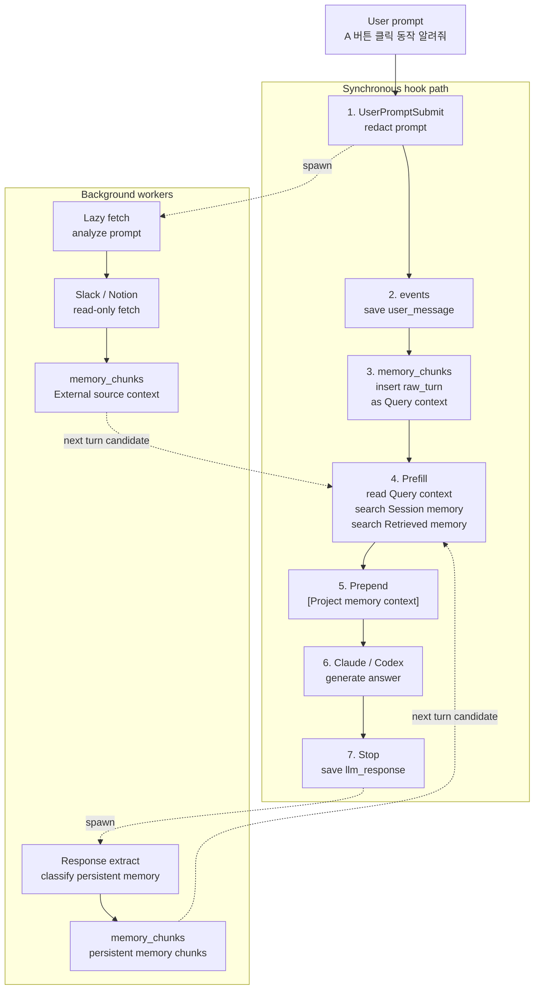
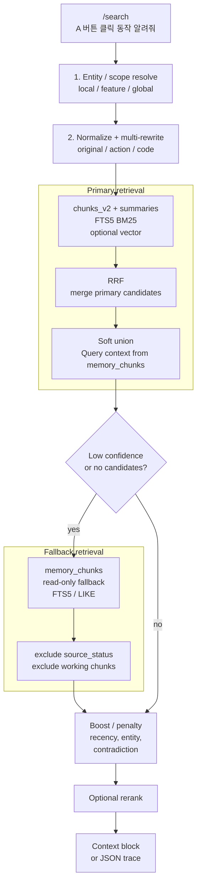
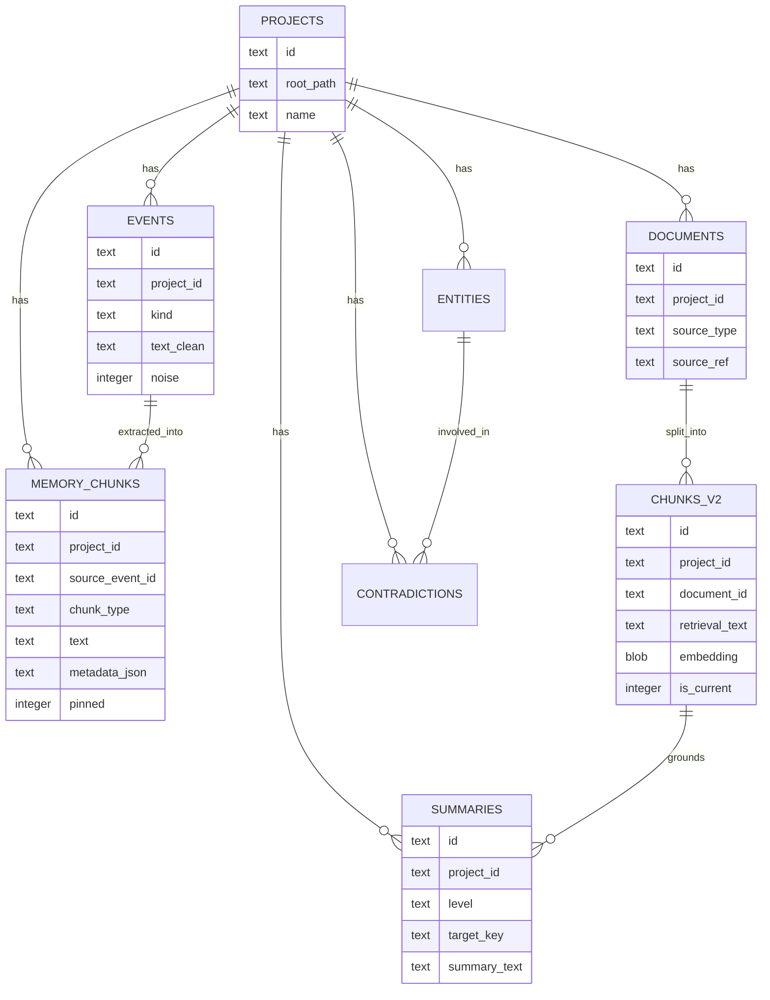

# imprint flow & dependencies

이 문서는 imprint 의 상세 동작 흐름을 설명합니다. 처음 사용하는 사람은 [`README.md`](README.md)를 먼저 보고, 실제 hook/retrieval 경로를 검증하거나 운영 이슈를 추적할 때 이 문서를 봅니다.

## 핵심 원칙

- hook 은 사용자 세션을 끊지 않습니다. 실패는 silent skip + `plugin.log` 로 처리합니다.
- 동기 경로는 가볍게 유지합니다. LLM 호출, Slack/Notion fetch, response extract 는 background 로 분리합니다.
- hook foreground 경로는 현재 turn 을 working mini-chunk 로 저장하고, 동기 경로의 context 보강은 가볍게 유지합니다.
- `/search` 는 사용자가 명시 호출했을 때 `chunks_v2`/`summaries` retrieval 을 수행하는 공개 진입점입니다.
- `/search` 는 현재 세션 working chunk 를 query context 로 soft union 하고, 문서 후보가 없거나 저신뢰이면 `memory_chunks` 를 read-only fallback 으로 조회합니다.
- `/remember`, Stop extract, external lazy-fetch 로 남은 persistent memory 는 `memory_chunks → chunks_v2` bridge 로 검색 후보에 복제됩니다. 기본 bridge 는 embedding 을 만들지 않으므로 vector 검색은 `--embed` backfill 또는 `IMPRINT_MEMORY_BRIDGE_EMBEDDING=1` 이후에 참여합니다.

## 전체 플로우

```text
사용자: "A 버튼 클릭 동작 알려줘"

[자동 hook 동기 경로]
  1. UserPromptSubmit: user_message event 저장
  2. noise=0 이면 현재 질문을 working mini-chunk 로 memory_chunks 에 즉시 저장
     - metadata_json.memory_tier=working
     - metadata_json.memory_kind=raw_turn
     - metadata_json.session_visible=true
     - metadata_json.need_retrieval=true/false
     - deterministic query rewrite 를 Search surface 로 보강
  3. .imprint/UserPromptSubmit.md routing 룰 매칭
  4. need-retrieval gate
     - yes: query context + query-aware retrieved/external context + fallback
     - no: query/session context 중심, retrieved-memory search skip
  5. [Project memory context] sections + routing advisory prepend
     - Query context
     - Session memory
     - Retrieved memory
     - External source context
  6. coding-agent 응답 생성
  7. Stop: 마지막 assistant 응답을 llm_response event 로 저장

[자동 hook 백그라운드 경로]
  A. UserPromptSubmit lazy-fetch
     - background model 이 prompt 키워드/URL 분석
     - prompt URL 또는 sources.json 기반 Slack/Notion read-only fetch
     - section chunk 를 memory_chunks 에 직접 INSERT
     - persistent external chunk 는 bridge 로 chunks_v2 후보에도 복제
     - source_status marker 는 bridge 대상에서 제외

  B. Stop response extract
     - background model 이 응답에서 persistent memory chunk 분류
     - decision/error/fix/command/test_result/summary/todo/code_context/note 를 memory_chunks 에 직접 INSERT
     - persistent extracted chunk 는 bridge 로 chunks_v2 후보에도 복제
     - 기본 bridge 는 embedding 을 생성하지 않음

다음 turn:
  새로 저장된 memory_chunks 가 다시 prefill 후보가 됩니다.

사용자: /search "A 버튼 클릭 동작 알려줘"

[/search 명시 호출 경로]
  1. entity resolve 선행 → scope classifier(local/feature/global)
  2. local: chunk retrieval 경로 호출
     - QN → RES → multi-rewrite → QEMB → HYB(chunks_v2 FTS5 + vector, 미가용 시 FTS/짧은 토큰 fallback) → RRF(+working overlay) → BOOST(+contradiction penalty) → low-confidence MEMFB → RG/RR → CTX
     - working overlay: 현재 세션 memory_tier=working, session_visible=true 후보를 query context 로 soft union
     - MEMFB: 후보가 0개이거나 저신뢰이면 memory_chunks read-only fallback(FTS/LIKE, vector 아님)
  3. feature/global: summaries 검색 + chunk retrieval(동일 working overlay/low-confidence MEMFB 포함) + summary_links grounding
  4. resolved entity 의 confirmed contradiction 조회
  5. 구조화 context block 또는 JSON 반환
```

## Mermaid

```mermaid
%%{init: {'flowchart': {'useMaxWidth': false, 'rankSpacing': 55, 'nodeSpacing': 42}, 'theme': 'default'}}%%
flowchart LR
    %% ===== Left: input signals =====
    subgraph IN["Input signals"]
      direction TB
      U["User prompt<br/>예: A 버튼 클릭 동작 알려줘"]
      A["Assistant response<br/>마지막 turn transcript"]
      E["External sources<br/>Slack / Notion URL<br/>sources.json keywords"]
      M["Manual memory<br/>/remember"]
      D["Document ingest<br/>raw docs for search"]
    end

    %% ===== Center: foreground hook path =====
    subgraph FG["Foreground hook path"]
      direction TB
      SS["SessionStart<br/>schema + project upsert<br/>soul.md prepend"]
      UPS["UserPromptSubmit<br/>redact + event archive"]
      MINI["Working mini-chunk<br/>raw_turn + deterministic surfaces"]
      GATE{"Need retrieval?"}
      PREFILL["Context section prefill<br/>Query context<br/>Session memory<br/>Retrieved memory<br/>External source context"]
      PREPEND["[Project memory context]<br/>+ routing advisory"]
      STOP["Stop hook<br/>llm_response archive"]
    end

    %% ===== Center: background LLM workers =====
    subgraph BG["Background model workers"]
      direction TB
      LF["Lazy fetch analyzer<br/>host CLI"]
      FETCH["Read-only fetch<br/>Slack / Notion"]
      EXTCHUNK["External chunks<br/>spec / message / thread"]
      EXTRACT["Response extractor<br/>host CLI"]
      DURABLE["Persistent memory chunks<br/>decision / fix / todo<br/>code_context / note"]
    end

    %% ===== Center-right: storage and retrieval =====
    subgraph STORE["SQLite memory store"]
      direction TB
      EVENTS[("events<br/>user_message / llm_response<br/>noise flag")]
      MEM[("memory_chunks<br/>working / retrieved / external<br/>FTS5 / LIKE")]
      DOCS[("documents + chunks_v2<br/>summaries / entities<br/>embeddings / contradictions")]
      PROF[("plugin.log<br/>profile.jsonl<br/>status / trace")]
    end

    subgraph RET["Explicit /search path"]
      direction TB
      QN["Normalize + multi-rewrite<br/>original / action / code"]
      RES["Entity resolve<br/>scope classifier"]
      HYB["Hybrid search<br/>chunks_v2/summaries<br/>FTS5 + optional vector"]
      RRF["RRF + working overlay"]
      BOOST["Boost / penalty<br/>recency, entity,<br/>contradiction"]
      MEMFB{"Low confidence?"}
      RR["optional rerank"]
      JSON["Context block<br/>or JSON trace"]
    end

    %% ===== Right: generation =====
    subgraph GEN["Generation"]
      direction TB
      HOSTMODEL["Host coding model"]
      OUT["User-visible answer"]
    end

    %% ===== Bottom: record format =====
    subgraph FORMAT["Memory / retrieval format"]
      direction LR
      F1["query context<br/>memory_tier=working<br/>provenance=raw_turn"]
      F2["retrieved memory<br/>assistant_extracted<br/>grounded=false"]
      F3["external source context<br/>raw_source<br/>grounded=true<br/>source_uri"]
      F4["status marker<br/>fetch_failed<br/>skipped_by_cap<br/>stale"]
      F5["trace<br/>query_surfaces<br/>fallback_reasons<br/>rerank_gate_reason"]
    end

    U --> UPS
    SS --> EVENTS
    SS --> PREPEND
    UPS --> EVENTS
    UPS --> MINI
    MINI --> MEM
    UPS --> GATE
    GATE --> PREFILL
    MEM --> PREFILL
    PREFILL --> PREPEND
    PREPEND --> HOSTMODEL
    HOSTMODEL --> OUT
    HOSTMODEL --> A
    A --> STOP
    STOP --> EVENTS

    UPS -.spawn.-> LF
    E --> LF
    LF --> FETCH
    FETCH --> EXTCHUNK
    EXTCHUNK --> MEM

    STOP -.spawn.-> EXTRACT
    EXTRACT --> DURABLE
    DURABLE --> MEM
    M --> MEM

    D --> DOCS
    DOCS --> RES
    MEM --> QN
    DOCS --> HYB
    QN --> RES
    RES --> HYB
    HYB --> RRF
    MEM --> RRF
    RRF --> BOOST
    BOOST --> MEMFB
    MEMFB -->|yes| MEM
    MEMFB -->|no| RR
    MEM --> RR
    RR --> JSON
    JSON --> HOSTMODEL

    EVENTS -.health.-> PROF
    MEM -.profile/status.-> PROF
    DOCS -.trace.-> PROF
    MEM -.metadata.-> FORMAT
    JSON -.explainability.-> FORMAT

    classDef input fill:#f7f7f7,stroke:#777,stroke-width:1px,color:#111;
    classDef sync fill:#fff3cd,stroke:#d89b00,stroke-width:1px,color:#111;
    classDef async fill:#e2f3f5,stroke:#238a92,stroke-width:1px,color:#111;
    classDef store fill:#e9f2ff,stroke:#3b73c4,stroke-width:1px,color:#111;
    classDef retrieve fill:#ede7f6,stroke:#7e57c2,stroke-width:1px,color:#111;
    classDef gen fill:#fde2e2,stroke:#c94c4c,stroke-width:1px,color:#111;
    classDef format fill:#e8f5e9,stroke:#4c8c4a,stroke-width:1px,color:#111;

    class U,A,E,M,D input;
    class SS,UPS,MINI,GATE,PREFILL,PREPEND,STOP sync;
    class LF,FETCH,EXTCHUNK,EXTRACT,DURABLE async;
    class EVENTS,MEM,DOCS,PROF store;
    class QN,RES,HYB,RRF,BOOST,MEMFB,RR,JSON retrieve;
    class HOSTMODEL,OUT gen;
    class F1,F2,F3,F4,F5 format;
```



## 노드 라벨

| 라벨 | 의미 | 노드 |
|---|---|---|
| Input signals | hook 과 retrieval 로 들어오는 원천 입력 | `U` · `A` · `E` · `M` · `D` |
| Foreground hook path | 사용자 turn 을 막지 않는 동기 경량 경로 | `SS` · `UPS` · `MINI` · `GATE` · `PREFILL` · `PREPEND` · `STOP` |
| Background model workers | background model CLI 를 쓰는 비동기 정리/추출/fetch 보조 경로 | `LF` · `FETCH` · `EXTCHUNK` · `EXTRACT` · `DURABLE` |
| SQLite memory store | 실제 저장소와 운영 관측 파일 | `EVENTS` · `MEM` · `DOCS` · `PROF` |
| Explicit /search path | 사용자가 명시 호출할 때만 도는 검색 파이프라인 | `QN` · `RES` · `HYB` · `RRF` · `BOOST` · `MEMFB` · `RR` · `JSON` |
| Generation | prepend 된 context 를 참고해 응답을 만드는 host 모델 경로 | `HOSTMODEL` · `OUT` |
| Memory / retrieval format | 후보의 의미와 디버깅 trace 를 설명하는 context/provenance metadata | `F1` · `F2` · `F3` · `F4` · `F5` |

## hook 단계별 의존성

### SessionStart

| 단계 | 의존 | 부재 시 |
|---|---|---|
| schema 적용 | `sqlite3` | DB 초기화 누락, hook 은 silent exit |
| project upsert | `sqlite3`, project root | memory project 분리 누락 |
| `.imprint/` seed | `bash`, filesystem | 기본 파일만 누락, 기존 파일은 덮어쓰지 않음 |
| `soul.md` emit | `cat` | persona prepend 누락 |

### UserPromptSubmit

| 경로 | 의존 | 부재 시 |
|---|---|---|
| prompt redaction | `python3`, redact rules | 실패 시 원문 대신 가능한 경로만 진행, 로그 기록 |
| `events.user_message` 저장 | `sqlite3`, `uuidgen` | event archive 누락 |
| working mini-chunk | `python3`, `sqlite3`, FTS5 | 첫 turn working overlay 누락, 기존 memory prefill 은 계속 시도 |
| gate + context section prefill | `python3`, `sqlite3`, FTS5 | retrieved-memory search/context section 분리 누락, legacy shell fallback 시도 |
| routing advisory | `python3`, `.imprint/UserPromptSubmit.md` | routing prepend 없음 |
| memory prefill | `python3`, `sqlite3`, FTS5 | primary prefill 누락, legacy shell fallback 시도 |
| lazy-fetch spawn | `python3`, host CLI, Slack/Notion MCP | 새 외부 chunk 누적 없음, 기존 chunk 는 계속 사용 |

### Stop

| 경로 | 의존 | 부재 시 |
|---|---|---|
| transcript parse | `python3`, `transcript_path` | 마지막 assistant 응답 archive 누락 |
| `events.llm_response` 저장 | `sqlite3`, `uuidgen` | response archive 누락 |
| response extract spawn | `python3`, host CLI | 자동 memory 추출 없음, `/remember` 로 수동 보강 가능 |

## 외부 소스 lazy-fetch

`<project>/.imprint/sources.json` 또는 prompt 안의 직접 URL 이 trigger 입니다.

| 항목 | 처리 |
|---|---|
| Notion 페이지 | H1/H2/H3 section chunk 로 저장 |
| Slack thread | 관련 reply selection + summary |
| Slack 단일 메시지 | 1 chunk |
| dedup | `source_uri/url + provenance(evidence_level) + text_hash` 기준, 기존 page URL cache hit 도 유지 |
| 갱신 | TTL 무한, `/memory refresh` 명시 명령 |
| URL cap | source 별 turn 당 3개, 초과분은 `source_status=skipped_by_cap` |
| 실패 표시 | `fetch_failed`, `fetch_empty`, `skipped_by_cap` marker |
| stale 표시 | `/memory list/show` 에서 `IMPRINT_STALE_DAYS` 기준 계산 |

## /search 경로

공개 진입점은 `/search "<질문>"` 과 셸 wrapper `imprint search "<질문>"` 입니다. 내부 디버깅이나 JSON trace 확인이 필요할 때만 `bash scripts/imprint/retrieve.sh --routed --json "<질문>"` 또는 `python3 -m retrieval.cli` 를 직접 호출합니다.

| scope | 동작 |
|---|---|
| local | `chunk_retrieve(query, top_k=10)` 후 confirmed contradiction 조회 |
| feature | feature summaries 검색 + feature chunk retrieval + summary_links grounding + contradiction 조회 |
| global | project/document/feature summaries 검색 + key chunk retrieval + grounding + contradiction 조회 |

`chunk_retrieve` 는 `chunks_v2` 후보가 있어도 현재 세션 working mini-chunk 를 query context 로 soft union 합니다. `chunks_v2` 후보가 없거나 top1 score 가 낮거나 working-only/entity-mismatch 로 저신뢰이면 `memory_chunks` fallback 을 탑니다. fallback 은 `source_status` marker 와 working chunk 를 제외합니다.

현재 vector 검색 범위는 `chunks_v2` 와 `summaries` 입니다. persistent `memory_chunks` 는 bridge 로 `chunks_v2` 에 복제되지만, embedding BLOB 이 없는 bridge row 는 FTS5 후보로만 동작합니다. `sentence-transformers` 설치 후 `bridge-memory <project_id> --all --embed` 로 기존 bridge row 를 채우거나, 새 저장 시 `IMPRINT_MEMORY_BRIDGE_EMBEDDING=1` 을 켜야 persistent memory 도 vector path 에 참여합니다.

confirmed contradiction 에 연결된 chunk 는 BOOST 단계에서 강하게 감점합니다. candidate contradiction 은 약하게 감점하고, routed output 의 conflict 섹션은 기존처럼 유지합니다.

## SQLite 테이블 역할

스키마는 `scripts/imprint/lib/schema.sql` 이 기준입니다. `SessionStart` 때 idempotent 하게 적용되며, 기본 DB 는 `~/.imprint/app.sqlite` 입니다.

### Core archive / memory

| 테이블 | 담당 역할 | 주요 writer | 주요 reader |
|---|---|---|---|
| `projects` | project root 를 안정적인 `project_id` 로 묶는 최상위 scope | `session-start.sh`, `common.sh` | 모든 hook/검색 경로 |
| `conversations` | host 대화 단위 메타데이터. 현재 핵심 경로에서는 보조적입니다. | 향후 conversation 연동 | `events.conversation_id` 참조 |
| `events` | user prompt 와 assistant response 의 redacted raw archive. `noise` flag 로 짧은 backchannel 을 구분합니다. | `user-prompt-submit.sh`, `stop.sh` | observability, provenance, 향후 raw audit |
| `memory_chunks` | 기본 사용자 기억 저장소. working raw turn, `/remember`, Stop extract, Slack/Notion lazy-fetch chunk, `source_status` marker 가 들어갑니다. | `ingestion.py`, `memory.sh`, `remember.sh` | prefill, `/memory`, `/search` fallback, bridge |

`events` 는 원문 archive 이고, `memory_chunks` 는 재사용 가능한 기억입니다. `/search` 의 의미 검색 대상은 raw events 전체가 아니라 `memory_chunks` 에서 선별·추출된 persistent memory 를 bridge 한 `chunks_v2` 입니다.

### FTS mirror

| 테이블 | 담당 역할 | 동기화 방식 |
|---|---|---|
| `events_fts` | `events.text_clean` 의 FTS5 trigram 인덱스. 현재 사용자-facing 검색 경로에는 직접 노출하지 않습니다. | `events_ai`, `events_ad` trigger |
| `memory_chunks_fts` | `memory_chunks.text` 의 FTS5 trigram 인덱스. `/memory search`, prefill, `/search` fallback 에 사용합니다. | `chunks_ai`, `chunks_ad`, `chunks_au` trigger |
| `chunks_v2_fts` | `chunks_v2.retrieval_text` 의 FTS5 trigram 인덱스. `/search` 의 chunk BM25 lane 입니다. | `chunks_v2_ai`, `chunks_v2_ad`, `chunks_v2_au` trigger |
| `summaries_fts` | `summaries.retrieval_text` 의 FTS5 trigram 인덱스. feature/global routed search 에 사용합니다. | `summaries_ai`, `summaries_ad`, `summaries_au` trigger |

### Retrieval v2

| 테이블 | 담당 역할 | 비고 |
|---|---|---|
| `documents` | 외부/명시 문서 원문과 synthetic memory document 를 저장합니다. `source_ref='memory_chunks:<id>'` 이면 bridge row 입니다. | Notion/Slack/PRD/file, memory bridge 의 원천 문서 |
| `chunks_v2` | `/search` 의 주 검색 단위. `retrieval_text`, optional `embedding`, type, validity, provenance metadata 를 가집니다. | vector + FTS hybrid 대상 |
| `summaries` | feature/document/project 단위 요약 검색 대상입니다. routed search 가 질문 범위에 맞춰 먼저 훑습니다. | optional embedding 포함 |
| `summary_links` | summary 가 대표하는 하위 summary/chunk 연결입니다. global/feature 결과에서 근거 chunk 로 drill-down 할 때 씁니다. | parent summary → child summary/chunk |

### Entity / conflict / queue

| 테이블 | 담당 역할 | 비고 |
|---|---|---|
| `entities` | feature, screen, UI element 같은 canonical entity 를 저장합니다. | entity resolve 의 기준점 |
| `entity_aliases` | 같은 entity 를 부르는 alias 와 confidence/status 를 저장합니다. | query resolve 와 review queue 성격 |
| `chunk_entities` | `chunks_v2` 와 entity mention 의 다대다 연결입니다. | entity boost, contradiction scope 에 사용 |
| `contradictions` | 같은 entity/scope 에서 충돌 가능성이 있는 chunk pair 판정 캐시입니다. | candidate 는 약한 감점, confirmed 는 강한 감점 |
| `ingest_queue` | summary/NER/contradiction 같은 후속 작업 queue 입니다. 현재 `memory_chunks` 직접 저장 경로는 queue 를 거치지 않고 bridge 까지만 수행합니다. | priority 낮을수록 먼저 처리 |

## 운영 정책 수치

UserPromptSubmit gate 는 결정적 rule 기반입니다. `noise=1`, 짧은 backchannel, 단순 확인/감사/커밋 요청은 retrieved-memory search 를 생략하고, `어떻게/왜/어디/동작/정리/찾아줘` 계열 표현이나 UI/code/source 키워드가 있으면 retrieved/external context 검색을 엽니다. gate 결과는 working chunk metadata 의 `need_retrieval`, `retrieval_reason` 과 `IMPRINT_PROFILE=1` 의 `cmd_prefill` record 에 남습니다.

### Foreground prefill / working memory

| 변수 | 기본값 | 수정 위치 | 바꾸면 달라지는 것 |
|---|---:|---|---|
| `IMPRINT_WORKING_CONTEXT_LIMIT` | `4` | env | query/session context 최대 개수 |
| `IMPRINT_PREFILL_LIMIT` | `8` | env | 자동 `[Project memory context]` 전체 chunk 상한 |
| `IMPRINT_WORKING_TTL_HOURS` | `24` | env | working raw_turn 보관 시간 |
| `IMPRINT_WORKING_MAX_PER_SESSION` | `20` | env | session 별 working raw_turn 최신 row 제한 |
| `IMPRINT_AMBIGUITY_THRESHOLD` | `0.5` | env | prompt 분석 결과의 ambiguity 판단 기준 |

### Lazy fetch / response extract

| 변수 | 기본값 | 수정 위치 | 바꾸면 달라지는 것 |
|---|---:|---|---|
| `IMPRINT_HOST` | auto | env | `claude`/`codex` host 감지 override |
| `IMPRINT_CLAUDE_BIN` | `claude` | env | Claude host background CLI |
| `IMPRINT_CLAUDE_MODEL` | `haiku` | env | Claude host background 모델 |
| `IMPRINT_CODEX_BIN` | `codex` | env | Codex host background CLI |
| `IMPRINT_CODEX_MODEL` | Codex 기본값 | env | Codex host background 모델 |
| `IMPRINT_MODEL_TIMEOUT_PREFILL` | `25` | env | prompt 분석 timeout 초 |
| `IMPRINT_MODEL_TIMEOUT_FETCH` | `45` | env | Slack/Notion fetch timeout 초 |
| `IMPRINT_MODEL_TIMEOUT_EXTRACT` | `30` | env | Stop response extract timeout 초 |
| `IMPRINT_ALLOWED_TOOLS_FETCH` | Notion/Slack wildcard | env | fetch worker 에 허용할 MCP tool 범위 |
| `CHUNK_TYPES` | 9개 persistent memory type | `ingestion.py` | Stop extract 가 저장할 수 있는 assistant memory type |
| `EXTERNAL_CHUNK_TYPES` | `spec/message/thread` | `ingestion.py` | Slack/Notion chunk type 구분 |

### Chunk retrieval / fusion

| 변수 | 기본값 | 수정 위치 | 바꾸면 달라지는 것 |
|---|---:|---|---|
| `VECTOR_TOPN` | `100` | `retrieve.py` | vector 후보 fan-out 크기 |
| `BM25_TOPN` | `100` | `retrieve.py` | FTS5/BM25 후보 fan-out 크기 |
| `FUSION_CANDIDATES` | `200` | `retrieve.py` | RRF/BOOST 이후 rerank 전 최대 후보 수 |
| `FINAL_TOPK_DEFAULT` | `10` | `retrieve.py` | CLI top_k 미지정 시 최종 context chunk 수 |
| `RRF_K` | `60` | `retrieve.py` | rank fusion 점수 smoothing |
| `RRF_VECTOR_WEIGHT` | `0.8` | `retrieve.py` | semantic/vector recall 가중치 |
| `RRF_BM25_WEIGHT` | `0.2` | `retrieve.py` | lexical/FTS5 BM25 가중치 |
| `BOOST_CURRENT` | `0.15` | `retrieve.py` | current chunk 가산점 |
| `BOOST_ENTITY` | `0.10` | `retrieve.py` | resolved entity match 가산점 |
| `BOOST_RECENT` | `0.05` | `retrieve.py` | 최근 source_updated_at 가산점 |
| `WORKING_OVERLAY_LIMIT` | `4` | `retrieve.py` | `/search` 에 soft union 할 query context 수 |
| `WORKING_OVERLAY_SCORE` | `0.12` | `retrieve.py` | query context 의 고정 점수 |
| `LOW_CONFIDENCE_TOP1` | `0.13` | `retrieve.py` | top1 이 낮을 때 `memory_chunks` fallback open |

### Rerank

| 변수 | 기본값 | 수정 위치 | 바꾸면 달라지는 것 |
|---|---:|---|---|
| `RG_MIN_CANDIDATES` | `10` | `retrieve.py` | 이보다 후보가 적으면 rerank skip |
| `RG_TOP1_THRESHOLD` | `0.85` | `retrieve.py` | top1 이 이 값 이상이면 rerank skip |
| `IMPRINT_RERANK_MODEL` | `BAAI/bge-reranker-v2-m3` | env | 사용할 cross-encoder 모델 |
| `IMPRINT_RERANK_TIMEOUT_MS` | `200` | env | rerank timeout ms |
| `IMPRINT_RERANK_CACHE_SIZE` | `64` | env | session-local rerank LRU cache 크기 |
| `IMPRINT_DISABLE_RERANK` | `0` | env | `1`이면 rerank 비활성 |

### Routed retrieval / summaries

| 변수 | 기본값 | 수정 위치 | 바꾸면 달라지는 것 |
|---|---:|---|---|
| `FEATURE_SUMMARY_LIMIT` | `5` | `routing.py` | feature scope summary 후보 수 |
| `FEATURE_CHUNK_LIMIT` | `8` | `routing.py` | feature scope chunk 후보 수 |
| `GLOBAL_PROJECT_LIMIT` | `1` | `routing.py` | global scope project summary 수 |
| `GLOBAL_DOCUMENT_LIMIT` | `3` | `routing.py` | global scope document summary 수 |
| `GLOBAL_FEATURE_LIMIT` | `5` | `routing.py` | global scope feature summary 수 |
| `GLOBAL_CHUNK_LIMIT` | `6` | `routing.py` | global scope key chunk 수 |
| `GROUND_DRILLDOWN_LIMIT` | `3` | `routing.py` | summary_links drill-down chunk 수 |

### Contradiction detection / penalty

| 변수 | 기본값 | 수정 위치 | 바꾸면 달라지는 것 |
|---|---:|---|---|
| `BOOST_CONTRADICTION_CONFIRMED` | `-1.0` | `retrieve.py` | confirmed contradiction chunk 감점 |
| `BOOST_CONTRADICTION_CANDIDATE` | `-0.20` | `retrieve.py` | candidate contradiction chunk 감점 |
| `IMPRINT_NLI_MODEL` | `MoritzLaurer/mDeBERTa-v3-base-mnli-xnli` | env | contradiction NLI 모델 |
| `IMPRINT_NLI_TIMEOUT_MS` | `500` | env | NLI 판정 timeout ms |
| `IMPRINT_MODEL_JUDGE_TIMEOUT_MS` | `30000` | env | model judge fallback timeout ms |
| `IMPRINT_CONTRADICTION_TIME_GAP_DAYS` | `90` | env | contradiction 후보 시간 간격 |
| `IMPRINT_CONTRADICTION_HIGH` | `0.8` | env | candidate 로 분류할 high threshold |
| `IMPRINT_CONTRADICTION_MID` | `0.4` | env | 현재는 기록용 mid threshold |
| `IMPRINT_MODEL_REFINE_LOW` | `0.4` | env | NLI mid 구간 하한, model judge 보강 시작 |
| `IMPRINT_MODEL_REFINE_HIGH` | `0.6` | env | NLI mid 구간 상한, model judge 보강 끝 |

### Storage / profile / safety

| 변수 | 기본값 | 수정 위치 | 바꾸면 달라지는 것 |
|---|---:|---|---|
| `IMPRINT_HOME` | `~/.imprint` | env | DB, log, profile 저장 위치 |
| `IMPRINT_DISABLE_LEGACY_MIGRATION` | `0` | env | `1`이면 `~/.claude/imprint/app.sqlite` 자동 migration 비활성 |
| `IMPRINT_PROFILE` | `0` | env | `1`이면 profile JSONL 기록 |
| `IMPRINT_STALE_DAYS` | `14` | env | 외부 source stale 표시 기준 |
| `IMPRINT_REDACT_RULES` | 사용자 파일 또는 default | env | redaction rule 파일 |
| `IMPRINT_BYPASS_HOOKS` | `0` | env | `1`이면 hook 즉시 종료, 재귀 가드 |
| `IMPRINT_DISABLE_EXTRACT` | `0` | env | `1`이면 Stop extract 비활성 |
| `IMPRINT_NO_SEED` | `0` | env | `1`이면 `.imprint/` 기본 파일 seed 비활성 |
| `IMPRINT_MODEL_CACHE_DIR` | HuggingFace 기본 cache | env | optional ML 모델 cache 위치 |
| `IMPRINT_DISABLE_EMBEDDING` | `0` | env | `1`이면 `chunks_v2`/`summaries` embedding/vector search 비활성 |
| `IMPRINT_DISABLE_NLI` | `0` | env | `1`이면 NLI contradiction judge 비활성 |
| `IMPRINT_DISABLE_MODEL_JUDGE` | `0` | env | `1`이면 model judge fallback 비활성 |

`retrieve_json` / `routed_json` 은 `trace.query_surfaces`, `fallback_reasons`, `rerank_gate_reason` 과 candidate 별 `context_section`, `lane`, `evidence_level`, `grounded`, `source_uri`, `text_hash`, `penalties` 를 노출합니다. `context_section`/`lane` 은 `query_context`, `retrieved_memory`, `external_source_context` 를 사용하며, `lane` 은 이전 JSON 소비자를 위한 호환 필드입니다. `evidence_level` 은 기존 DB 호환을 위한 provenance field 입니다. 이 값은 context 품질 회고와 gate/MEMFB/rerank threshold 튜닝에 사용합니다.

튜닝할 때는 env 로 조정 가능한 값부터 바꾸고, `retrieve.py`/`routing.py` 의 코드 상수는 테스트와 함께 PR 로 변경합니다. 변경 후에는 내부 JSON trace 와 `IMPRINT_PROFILE=1` 의 `retrieve_done`, `cmd_prefill` record 를 같이 확인합니다.

## latency budget

UPS hook 자동 경로는 `LOG → ROUTE → PREFILL → CTX0` 만 실행해 < 50 ms 를 목표로 합니다. 아래 budget 은 사용자가 `/search` 를 명시 호출했을 때 기준입니다.

| 케이스 | budget | 구성 |
|---|---|---|
| local + rerank skip | < 130 ms | QN + RES + QEMB + HYB + RRF + BOOST + MEMFB + CTX |
| feature/global + rerank skip | < 200 ms | RES/SC + summary 검색 + chunk retrieval + GROUND + CCHECK |
| any scope + rerank 발동 | < 330 ms | 위 경로 + RR, timeout 시 fall-through |

위반이 반복되면 `IMPRINT_PROFILE=1` 데이터를 보고 `QEMB`, `HYB`, `FSUM`, `GSUM`, `RR` 중 병목을 daemon backend 로 분리합니다.

## ingest_queue 우선순위

`ingest_queue` 는 retrieval v2 문서 ingestion 뒤 후속 작업을 `priority ASC, created_at ASC` 로 drain 합니다. 자동 UPS/Stop hook 의 `memory_chunks` 저장 경로에는 끼지 않습니다.

| Job | priority | 이유 |
|---|---|---|
| `summary_regen` | 5 | feature/global 질문 대응 품질 |
| `contradiction_scan` | 5 | conflict 표시 품질 |
| `ner_extract` | 9 | alias 사전 점진 개선 |

`ingest_queue.py` 에는 J1/J2/J3 우선순위 상수도 있지만 현재 활성 enqueue 경로는 `dispatch_commit` 기준 J4/J5/J6 입니다.

## 운영 환경 변수

| 변수 | 기본값 | 의미 |
|---|---|---|
| `IMPRINT_HOME` | `~/.imprint` | DB, log, profile 저장 위치 |
| `IMPRINT_DISABLE_LEGACY_MIGRATION` | `0` | `1`이면 legacy Claude DB 자동 migration 비활성 |
| `IMPRINT_HOST` | auto | `claude`/`codex` host 감지 override |
| `IMPRINT_CLAUDE_BIN` | `claude` | Claude host background CLI |
| `IMPRINT_CLAUDE_MODEL` | `haiku` | Claude host background 모델 |
| `IMPRINT_CODEX_BIN` | `codex` | Codex host background CLI |
| `IMPRINT_CODEX_MODEL` | Codex 기본값 | Codex host background 모델 |
| `IMPRINT_MODEL_TIMEOUT_PREFILL` | `25` | prompt 분석 timeout 초 |
| `IMPRINT_MODEL_TIMEOUT_FETCH` | `45` | Slack/Notion fetch timeout 초 |
| `IMPRINT_MODEL_TIMEOUT_EXTRACT` | `30` | response extract timeout 초 |
| `IMPRINT_ALLOWED_TOOLS_FETCH` | Notion/Slack wildcard | fetch 호출에 넘길 allowed tools |
| `IMPRINT_BYPASS_HOOKS` | `0` | `1`이면 hook 즉시 종료, 재귀 가드 |
| `IMPRINT_DISABLE_EXTRACT` | `0` | `1`이면 Stop extract 비활성 |
| `IMPRINT_NO_SEED` | `0` | `1`이면 `.imprint/` 기본 파일 seed 비활성 |
| `IMPRINT_PROFILE` | `0` | `1`이면 profile JSONL 기록 |
| `IMPRINT_STALE_DAYS` | `14` | 외부 source stale 표시 기준 |
| `IMPRINT_REDACT_RULES` | 사용자 파일 또는 default | redaction rule 경로 |

## 데이터 위치

| 경로 | 내용 |
|---|---|
| `<project>/.imprint/soul.md` | 세션 시작·압축 후 prepend 되는 project persona |
| `<project>/.imprint/UserPromptSubmit.md` | keyword 기반 routing advisory rule |
| `<project>/.imprint/sources.json` | Slack/Notion lazy-fetch 대상 |
| `~/.imprint/app.sqlite` | events, memory_chunks, retrieval v2 tables |
| `~/.imprint/plugin.log` | hook, dispatcher, ingestion log |
| `~/.imprint/profile.jsonl` | `IMPRINT_PROFILE=1` 일 때 stage 측정값 |

## graceful degradation

| 실패 | 결과 |
|---|---|
| `sqlite3` 없음 | 저장과 검색 누락, hook 은 진행 |
| `python3` 없음 | primary prefill/lazy-fetch/extract 누락 |
| background model CLI 없음 | background model 경로 누락 |
| Slack/Notion MCP 없음 | 외부 fetch 0건, 기존 memory 는 유지 |
| 선택 ML 의존성 없음 | `chunks_v2`/`summaries` vector/rerank/NLI 비활성, FTS-only / rule fallback |
| malformed LLM JSON | relaxed parse 실패 후 skip |

`.imprint/` 폴더는 SessionStart hook 이 처음 실행될 때 자동 생성되며 기존 파일은 덮어쓰지 않습니다.

## Alternate Mermaid Views

위의 flowchart 는 전체 시스템 지도입니다. 아래 다이어그램은 같은 구조를 다른 관점에서
보여줍니다. 처음 읽는 사람은 단계형 flowchart 로 실행 순서를 먼저 보고, ER diagram
으로 저장소 역할을 확인하면 이해하기 쉽습니다.

### Automatic Hook Sequence



### Explicit Search Sequence



### Storage ER Diagram



`MEMORY_CHUNKS` 에는 현재 embedding 컬럼이 없습니다. 위 ER diagram 에서 embedding 은 `CHUNKS_V2` 에만 표시됩니다.
