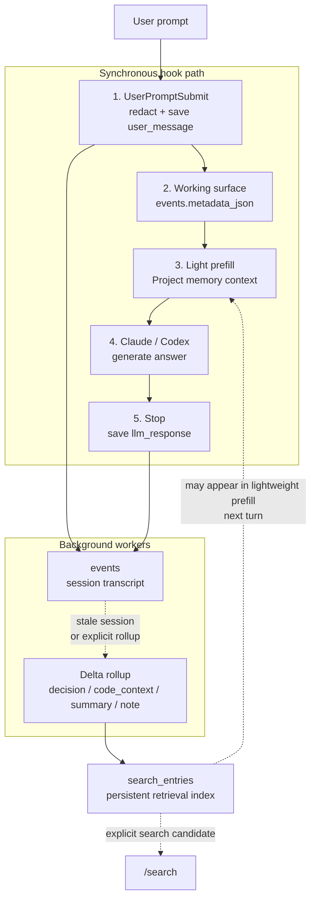
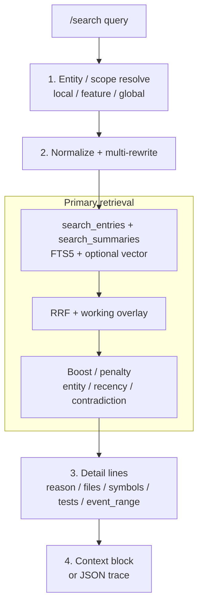
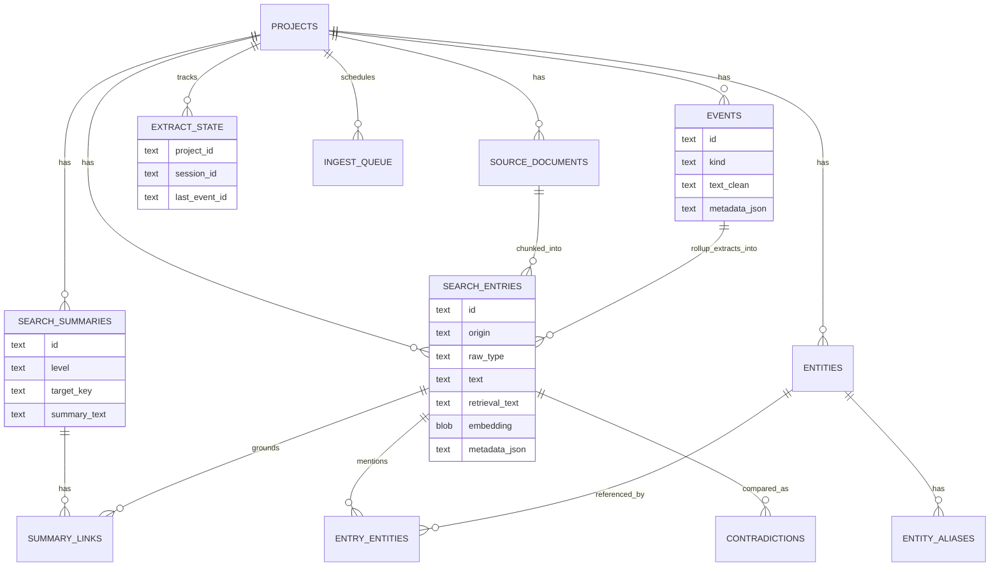

# imprint flow

이 문서는 imprint 가 **무엇을 저장하고, 언제 검색하고, 어디서 다시 꺼내 쓰는지**를 빠르게 이해하기 위한 문서입니다. 세부 결정 사유는 `HISTORY.md`, 다음 작업은 `HANDOFF.md`, 제품 방향은 `LoadMap.md` 를 봅니다.

## 핵심 원칙

- 일반 대화는 가볍게 기록합니다. hook 은 사용자 세션을 끊지 않고, 실패하면 `plugin.log` 에만 남깁니다.
- 무거운 작업은 background 로 보냅니다. rollup extract 는 동기 응답 경로를 막지 않습니다.
- raw 대화 전체를 `/search` 에 자동 fallback 하지 않습니다. `/search` 는 정제된 `search_entries`, `search_summaries`, 현재 세션 working surface 만 사용합니다.
- 영구 기억은 `search_entries` 로 모읍니다. `/remember`, rollup extract, source document ingest 가 같은 검색 인덱스를 씁니다.
- vector 검색은 선택 기능입니다. `imprint setup vector --backfill` 로 `search_entries.embedding` 을 채운 뒤에만 semantic lane 이 참여합니다.
- Slack/Notion fetch 는 기본 RAG 루프가 아니라 opt-in external source cache 입니다. 자동 lazy fetch 는 `IMPRINT_ENABLE_LAZY_FETCH=1` 일 때만 켭니다.

## 사용 기술과 역할

| 기술 | 쓰이는 곳 | 역할 |
|---|---|---|
| Claude Code / Codex plugin manifest | `.claude-plugin`, `.codex-plugin`, `plugin.json` | 같은 hook/skill/runtime 을 Claude Code 와 Codex 양쪽에서 로드합니다. |
| Bash hook/dispatcher | `session-start.sh`, `user-prompt-submit.sh`, `stop.sh`, `search.sh`, `remember.sh`, `rollup.sh` | host 가 호출하는 얇은 진입점입니다. 세션을 막지 않도록 실패는 로그로 내리고, 무거운 작업은 background 로 보냅니다. |
| Python retrieval runtime | `scripts/imprint/lib/retrieval/*.py`, `ingestion.py` | chunk 저장, 검색 조립, entity/summary/contradiction, migration, rollup 같은 결정적 로직을 담당합니다. |
| SQLite + WAL | `~/.imprint/app.sqlite` | 로컬 영구 저장소입니다. WAL 로 읽기/쓰기 경합을 줄이고, hook write 는 짧게 끝내는 것을 원칙으로 합니다. |
| SQLite FTS5 trigram | `search_entries_fts`, `search_summaries_fts` | 기본 lexical 검색입니다. 파일명, 함수명, 에러 문자열, 명령어처럼 정확한 토큰 회수에 필요합니다. |
| Optional vector embedding | `search_entries.embedding`, `search_summaries.embedding` | `sentence-transformers` 의 BGE-M3 로 의미 유사도 lane 을 추가합니다. 설치하지 않으면 FTS-only 로 동작합니다. |
| Optional rerank / NLI | `rerank.py`, `contradiction.py` | cross-encoder rerank 와 contradiction 판정 품질을 올립니다. 없으면 rule/LLM fallback 으로 내려갑니다. |
| Background LLM call | Claude/Codex CLI | Rollup rich extract, summary/contradiction judge 를 세션 밖에서 수행합니다. |
| Optional external fetch | Slack/Notion MCP | `IMPRINT_ENABLE_LAZY_FETCH=1` 또는 `/memory refresh <url>` 로 외부 source 를 캐시합니다. 현재 turn 답변 근거로 보장하지 않고 다음 검색 후보로만 봅니다. |
| Redaction rule | `redact-rules.default.json`, `redact_text` | event, extract text, rollup metadata, retrieval surface 에 민감정보가 남지 않도록 저장 전 정리합니다. |
| RRF + boost/penalty | `retrieve.py`, `routing.py` | FTS/vector/summary/working 후보를 합치고 entity, recency, contradiction 신호로 정렬합니다. |

현재 핵심 검색 경로는 **FTS5 가 기본**, **vector 가 선택 보강**, **rollup 이 session 단위 `events` 에서 검색용 implementation memory 를 만드는 후처리**입니다. raw `events` 는 archive/provenance 로 보존하지만 `/search` primary index 로 직접 쓰지 않습니다.

## Alternate Mermaid Views

### 일반 LLM 사용 Sequence

평소처럼 LLM 과 대화하거나 코딩 작업을 맡길 때의 경로입니다. 이 경로는 raw 대화를 `events` 에 기록하고, 가벼운 prefill 만 수행합니다. 구현 기억은 session 이 stale 이거나 사용자가 명시 rollup 을 실행했을 때 background 에서 `search_entries` 로 정리됩니다.



### 명시 `/search` Retrieve Sequence

사용자가 `/search "왜 이렇게 구현했지?"`처럼 명시적으로 검색할 때의 경로입니다. 일반 대화 prefill 보다 더 무거운 retrieval 을 수행하고, rollup 이 남긴 세부 근거를 함께 보여줍니다.



### Storage ER Diagram



### Storage Schema 요약

| 테이블 | 역할 | 핵심 포인트 |
|---|---|---|
| `projects` | project root 단위 scope | 모든 row 는 project_id 로 분리됩니다. |
| `events` | redacted user/assistant raw archive | working surface 와 session_id 도 `metadata_json` 에 저장합니다. |
| `extract_state` | rollup cursor | session 별로 어디까지 rich extract 했는지 기록합니다. |
| `source_documents` | PRD/ADR/file/명시 ingest 원본 | synthetic memory 문서는 넣지 않습니다. opt-in Slack/Notion lazy fetch 는 보통 이 테이블이 아니라 `search_entries(origin=external_fetch)` 로 들어갑니다. |
| `search_entries` | 단일 검색 entry 인덱스 | `/remember`, rollup extract, source chunk 가 들어옵니다. opt-in external fetch 도 같은 인덱스를 사용합니다. |
| `search_summaries` | feature/document/project 요약 | routed `/search` 에서 큰 범위 질문을 받쳐줍니다. |
| `summary_links` | summary 와 근거 entry 연결 | feature/global 결과의 grounding 에 사용합니다. |
| `entities`, `entity_aliases`, `entry_entities` | entity resolve 와 mention 연결 | boost, contradiction scope 에 사용합니다. |
| `contradictions` | entry 간 충돌 판정 cache | confirmed 는 검색 점수에서 강하게 감점합니다. |
| `ingest_queue` | summary/NER/contradiction 후속 작업 queue | `/remember` 와 rollup 직접 저장 경로에는 끼지 않습니다. |
| `search_entries_fts`, `search_summaries_fts` | FTS5 mirror | SQLite trigger 로 원본 테이블과 동기화됩니다. |

## 주요 저장 경로

| 입력 | 저장 위치 | 다음에 쓰이는 곳 |
|---|---|---|
| user prompt | `events(kind=user_message)` | working overlay, observability |
| assistant response | `events(kind=llm_response)` | rollup provenance |
| 현재 turn query surface | `events.metadata_json` | 다음 prefill, `/search` working overlay |
| `/remember` | `search_entries(origin=manual_remember)` | `/search`, `/memory`, prefill |
| delta/rollup rich extract | `search_entries(origin=assistant_extract)` | 다음 turn prefill 후보가 될 수 있고, `/search` 에서는 decision/code_context/summary/note 근거로 검색됩니다. `assistant_extract` 는 현재 schema 의 legacy origin 이름입니다. |
| opt-in Slack/Notion fetch | `search_entries(origin=external_fetch)` | external source context |
| PRD/ADR/file/명시 source ingest | `source_documents` + `search_entries(origin=source_document)` | source-grounded retrieval |

## `/search` 동작

공개 진입점은 `/search "<질문>"` 과 `imprint search "<질문>"` 입니다.

| scope | 동작 |
|---|---|
| `local` | `search_entries` 중심으로 직접 관련 entry 를 찾습니다. |
| `feature` | feature summary 를 먼저 보고 관련 entry 로 drill-down 합니다. |
| `global` | project/document/feature summary 를 함께 보고 대표 entry 를 붙입니다. |

검색 후보는 다음 정보를 가질 수 있습니다.

- `text`: 사용자에게 보여줄 본문
- `retrieval_text`: FTS/vector 검색용 surface
- `role=canonical_memory`: 사용자가 `/remember` 로 명시 저장한 큰 틀 기억
- `role=rollup_evidence`: rollup 이 대화에서 추출한 구현 근거
- `metadata.reason`: 왜 그렇게 결정했는지
- `metadata.files`, `metadata.symbols`: 관련 파일/심볼
- `metadata.tests`: 검증 근거
- `metadata.event_range`, `source_event_id`: 원래 대화 provenance

큰 틀/정책/요약 계열 질문에서는 `canonical_memory` 를 더 앞에 두고, 왜/어떻게/구현/파일/테스트 계열 질문에서는 `rollup_evidence` 를 더 앞에 둡니다. 같은 주제의 `/remember` 와 rollup row 를 저장 단계에서 합치지 않는 이유는, manual memory 는 사용자가 직접 남긴 canonical note 이고 rollup 은 원문 대화 provenance 를 가진 evidence 이기 때문입니다.

저신뢰 상황은 trace 에 남기지만 raw `events` 전체를 자동 검색하지 않습니다. raw 대화 전체 검색이 필요하면 별도 explicit debug 경로로 다루는 것이 원칙입니다.

## 일반 LLM 대화와 `/search` 의 차이

| 구분 | 일반 LLM 대화 | 명시 `/search` |
|---|---|---|
| 목적 | 지금 질문에 답하면서 가볍게 기억을 보강 | 저장된 구현 맥락과 근거를 직접 회수 |
| 동기 비용 | 낮게 유지 | retrieval 비용 허용 |
| 읽는 데이터 | working surface + `search_entries` 기반 제한 prefill | `search_entries`, `search_summaries`, working overlay |
| 출력 | 일반 답변 | context block 또는 JSON trace |
| raw events fallback | 없음 | 없음 |

## 운영 참고

### 자주 보는 명령

```bash
python3 scripts/imprint/tests/run_tests.py
imprint setup vector --status
imprint setup vector --backfill
imprint migrate search-entries
```

### 핵심 환경 변수

| 변수 | 기본값 | 의미 |
|---|---|---|
| `IMPRINT_HOME` | `~/.imprint` | DB, log, profile 저장 위치 |
| `IMPRINT_PROFILE` | `0` | `1`이면 profile JSONL 기록 |
| `IMPRINT_DISABLE_ROLLUP` | `0` | `1`이면 SessionStart stale rollup 비활성 |
| `IMPRINT_ENABLE_LAZY_FETCH` | `0` | `1`이면 UserPromptSubmit 에서 Slack/Notion lazy fetch 활성 |
| `IMPRINT_ROLLUP_STALE_MINUTES` | `30` | stale session rollup 기준 |
| `IMPRINT_ROLLUP_BATCH_EVENTS` | `24` | rollup 1회 처리 event 상한 |
| `IMPRINT_ROLLUP_MAX_CHARS` | `12000` | rollup model 입력 문자 상한 |
| `IMPRINT_STALE_DAYS` | `14` | external source stale 표시 기준 |
| `IMPRINT_REDACT_RULES` | default 또는 사용자 파일 | redaction rule 경로 |

### 데이터 위치

| 경로 | 내용 |
|---|---|
| `<project>/.imprint/Guardrail.md` | 세션 시작·압축 후 prepend 되는 project Guardrail |
| `<project>/.imprint/UserPromptSubmit.md` | keyword 기반 routing advisory rule |
| `<project>/.imprint/sources.json` | opt-in Slack/Notion fetch 대상 |
| `~/.imprint/app.sqlite` | SQLite DB |
| `~/.imprint/plugin.log` | hook, dispatcher, ingestion log |
| `~/.imprint/profile.jsonl` | `IMPRINT_PROFILE=1` 측정값 |

### Graceful degradation

| 실패 | 결과 |
|---|---|
| `sqlite3` 없음 | 저장과 검색 누락, hook 은 진행 |
| `python3` 없음 | primary prefill/rollup 누락 |
| background model CLI 없음 | background model 경로 누락 |
| Slack/Notion MCP 없음 | opt-in 외부 fetch 0건, 기존 memory 는 유지 |
| 선택 ML 의존성 없음 | FTS-only / rule fallback |
| malformed LLM JSON | relaxed parse 실패 후 skip |
