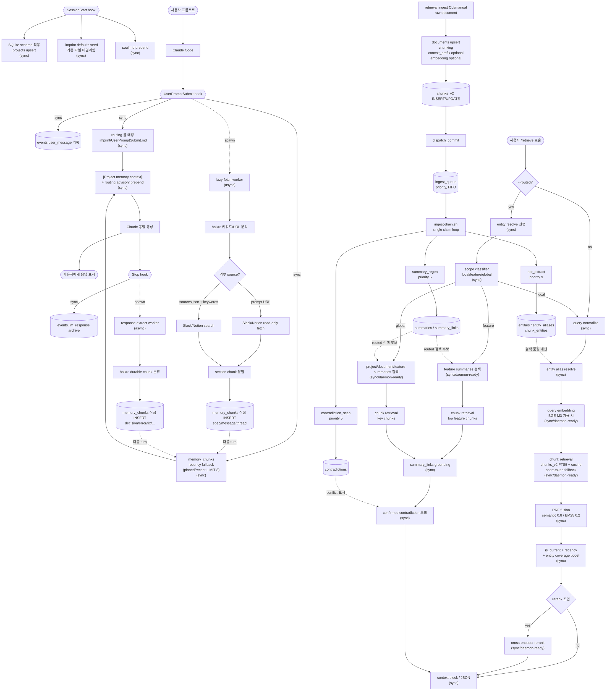

# imprint — Claude Code plugin

로컬 작업 기억(SQLite + FTS5), 외부 소스(Slack · Notion) lazy-fetch, statusline HUD를 Claude Code의 hook · skill · subagent 시스템으로 제공하는 plugin입니다.

## 설치

자세한 절차는 [`INSTALL.md`](INSTALL.md). 요약:

```bash
# 이 repo가 marketplace로 등록되어 있다면
claude plugin marketplace add <this-repo>
claude plugin install imprint@imprint
```

설치 후 Claude Code 세션을 새로 열면 `SessionStart` hook이 SQLite 스키마를 idempotent하게 생성합니다.

### 사전 조건

기본 동작은 `python3` + `sqlite3` + `claude` CLI 만 있으면 됩니다 (macOS 기본 포함 + Claude Code 설치 시 자동). 추가 의존성 없이도 FTS5 trigram 검색 + claude CLI LLM judge fallback 으로 retrieval / contradiction 모두 동작합니다.

선택 의존성 (정확도 향상):

```bash
pip install -r requirements-optional.txt
# sqlite-vec (벡터 검색 가속) + sentence-transformers (BGE-M3 임베딩 + cross-encoder rerank) + transformers (NLI 동기 경로)
```

미설치 시 자동으로 fallback path 사용. 외부 소스(Slack / Notion) lazy-fetch 는 별도 MCP 등록이 필요합니다 ([`INSTALL.md`](INSTALL.md) "선택: ML 의존성" 참조).

## 무엇을 하는가

| 영역 | 역할 |
|---|---|
| Soul (persona) | `SessionStart` hook이 `<project>/.imprint/soul.md` 내용을 컨텍스트 시작에 prepend. 압축 후에도 `compact` matcher로 자동 재주입 |
| Routing | `UserPromptSubmit` hook이 `<project>/.imprint/UserPromptSubmit.md`의 키워드 → agent 룰을 평가, 매칭 시 권고 메시지 prepend |
| Memory | 프롬프트·응답·외부 소스를 `~/.claude/imprint/app.sqlite`에 누적, FTS5 trigram으로 한국어 부분일치 검색. 매 prompt마다 관련 chunk를 `[Project memory context]` 블록으로 자동 prepend |
| Retrieval | `/retrieve` 명시 호출 시 `chunks_v2`/`summaries` 를 대상으로 hybrid retrieval (FTS5 + sqlite-vec, 미가용 시 FTS/짧은 토큰 fallback) → RRF fusion → BOOST → 조건부 cross-encoder rerank → grounding/contradiction check. retrieval v2 문서 ingestion 은 `documents`/`chunks_v2` 를 갱신한 뒤 `ingest_queue` 로 NER·summary rebuild·contradiction scan 후속 작업을 예약 |
| HUD | Claude Code statusline에 `5h: 25% (1h 49m) │ wk: 3% (1d 9h) │ ctx: 12% │ skills: 17 │ agents: 1` 형태로 잔여 시간과 활성 plugin의 skills/agents 수 표시 |

## 어떻게 동작하는가

매 turn마다 turn 사이클 hook 2개(`UserPromptSubmit` · `Stop`)가 **동기·비동기 두 경로**로 작동합니다(세션 진입 시점에는 별도로 `SessionStart` 가 1회 발동 — 스키마 적용 + soul.md prepend). UPS hook 의 **자동 동기 경로**는 `events.user_message` 기록 + routing 룰 매칭 + `memory_chunks` recency fallback(LIMIT 8) 만 emit 해서 < 50 ms 안에 끝납니다. LLM 호출(`claude -p haiku`)·외부 fetch·응답 chunk 추출 같은 무거운 작업은 백그라운드로 분리되며, 현재 자동 hook 경로는 결과를 `memory_chunks` 에 직접 저장합니다. **풀 하이브리드 retrieval**(`QN → RES → QEMB → HYB → RRF → BOOST → RG → RR → CTX`, routed 경로는 `SC → GROUND → CCHECK` 포함)은 hook 이 자동으로 부르지 않고, 사용자가 `/retrieve` 또는 `/retrieve --routed` 디스패처를 명시 호출했을 때만 실행됩니다.

### 전체 플로우

아래 예시는 현재 구현 기준의 두 저장/검색 경로를 분리해서 보여줍니다. 일반 prompt 입력(UPS hook 자동 경로)은 `memory_chunks` 를 읽고 쓰며, `/retrieve` 디스패처는 별도 `chunks_v2`/`summaries` 검색 경로를 사용합니다.

```
사용자: "A 버튼 클릭 동작 알려줘"

[자동 hook 동기 경로]
  1. UserPromptSubmit: user_message event 저장
  2. .imprint/UserPromptSubmit.md routing 룰 매칭
  3. memory_chunks pinned/recent LIMIT 8 prefill
  4. [Project memory context] + (매칭 시) routing advisory prepend
  5. Claude 응답 생성
  6. Stop: 마지막 assistant 응답을 llm_response event 로 저장

[자동 hook 백그라운드 경로]
  A. UserPromptSubmit lazy-fetch
     - Haiku가 prompt 키워드/URL 분석
     - prompt URL 또는 sources.json 기반 Slack/Notion read-only fetch
     - section chunk 를 memory_chunks 에 직접 INSERT

  B. Stop response extract
     - Haiku가 응답에서 durable chunk 분류
     - decision/error/fix/command/test_result/summary/todo/code_context/note 를 memory_chunks 에 직접 INSERT

다음 turn:
  새로 저장된 memory_chunks 가 다시 prefill 후보가 됩니다.

사용자: /retrieve --routed "A 버튼 클릭 동작 알려줘"

[/retrieve 명시 호출 경로]
  1. routed: entity resolve 선행 → scope classifier(local/feature/global)
  2. local: chunk retrieval 경로 호출
     - QN → RES → QEMB → HYB(chunks_v2 FTS5 + vector, 미가용 시 FTS/짧은 토큰 fallback) → RRF → BOOST → RG/RR → CTX
  3. feature/global: summaries 검색 + chunk retrieval + summary_links grounding
  4. resolved entity 의 confirmed contradiction 조회
  5. 구조화 context block 또는 JSON 반환
```

## hook

세션 라이프사이클 hook 1개 (`SessionStart`) + turn 사이클 hook 2개 (`UserPromptSubmit`, `Stop`) 의 총 3개로 구성. 정의는 `hooks/hooks.json`.

| hook | matcher | 시점 | 동기 경로 | 비동기 경로 |
|---|---|---|---|---|
| **SessionStart** | `startup\|resume\|clear\|compact` | 세션 진입 / 재개 / clear / compact 직후 | SQLite 스키마 idempotent 적용 + 현재 프로젝트 row upsert + `<project>/.imprint/soul.md` 컨텍스트 prepend (timeout 5 s) | — |
| **UserPromptSubmit** | `*` | 프롬프트 진입 직전 (매 turn) | `events.user_message` 기록 → `.imprint/UserPromptSubmit.md` routing 룰 advisory prepend → `memory_chunks` recency fallback (primary: `ingestion.py prefill` LIMIT 8, legacy shell fallback: LIMIT 5) → `[Project memory context]` 블록 prepend (< 50 ms). **풀 하이브리드 retrieval 은 `/retrieve` 디스패처 명시 호출 경로로만 진입** | `claude -p haiku` 로 키워드·모호도 추출 → prompt 의 Notion/Slack URL 또는 `sources.json` 기반 lazy-fetch → 외부 chunk INSERT (≈30~60 초, timeout 30 s) |
| **Stop** | `*` | 응답 종료 직후 (매 turn) | `events.llm_response` 로 응답 텍스트 archive | `claude -p haiku` 가 응답을 9 가지 `chunk_type` (`decision` · `error` · `fix` · `command` · `test_result` · `summary` · `todo` · `code_context` · `note`) 로 분류해 `memory_chunks` 에 누적. 외부 source (Slack · Notion) 는 UPS lazy-fetch 경로에서 `spec` · `message` · `thread` 로 직접 INSERT (timeout 30 s) |

서브프로세스가 다시 hook 을 타며 자기 자신을 spawn 하는 무한 재귀는 `IMPRINT_BYPASS_HOOKS=1` 을 환경에 박아 차단합니다.

### 외부 소스 lazy-fetch (Notion · Slack)

`<project>/.imprint/sources.json` 에 등록된 채널·페이지, 또는 prompt 안에 직접 들어온 Notion/Slack URL 을 백그라운드 워커가 read-only MCP 로 가져와 섹션 단위로 chunk 화합니다.

```json
{
  "slack": { "channels": ["#ios-payment", "#ios-bugs"] },
  "notion": { "pages": ["a1b2c3d4-payment-prd"] }
}
```

sectioning 룰 · dedup · TTL · graceful degradation 명세는 [`flow.md`](flow.md) "외부 소스 lazy-fetch 처리 룰" 참조. 시스템 도구·운영 환경 변수·실패 모드 매핑도 같은 문서.

## 전체 플로우 다이어그램

현재 구현은 세 경로가 분리되어 있습니다. **(1) 세션 시작**, **(2) 매 turn 자동 hook**은 `memory_chunks` 중심으로 동작하고, **(3) 사용자 명시 `/retrieve` 디스패처**는 `chunks_v2`/`summaries` 중심으로 검색합니다. `ingest_queue` 는 retrieval 문서 ingestion 이후 후속 작업(`summary_regen`, `contradiction_scan`, `ner_extract`)을 drain 할 때 사용되며, 자동 UPS/Stop hook 의 `memory_chunks` 저장 경로에는 끼지 않습니다.



### 노드 라벨 분류

| 라벨 | 의미 | 노드 |
|---|---|---|
| `(sync)` SessionStart / UPS / Stop | 세션 시작과 매 turn hook 동기 경로 | `SCHEMA` · `SEED` · `SOUL` · `LOG` · `ROUTE` · `PREFILL` · `CTX0` · `LOG2` |
| `(sync)` /retrieve 진입 | `/retrieve` 디스패처 동기 경로 | `QN` · `RES` · `RRES` · `SCOPE` · `RRF` · `BOOST` · `GROUND` · `CCHECK` · `CTX` |
| `(sync/daemon-ready)` | `/retrieve` 동기 경로 중 무거운 후보 — daemon 분리 1순위 | `QEMB` · `HYB` · `FSUM` · `GSUM` · `RR` |
| `(async)` 자동 hook 백그라운드 | 사용자 turn 차단 없이 `memory_chunks` 에 직접 저장 | `LF` · `ANL` · `FETCH` · `SRCSEARCH` · `SPLIT_EXT` · `EXTRACT` · `CLASSIFY` |
| `ingest_queue` | retrieval v2 문서 ingestion 뒤 후속 작업을 순차 drain | `ENQ` · `DRAIN` · `J4` · `J5` · `J6` |

### 동기 경로 latency budget

UPS hook 자동 경로는 `LOG → ROUTE → PREFILL → CTX0` 만 실행해 < 50 ms 안에 끝납니다(SQLite INSERT 1 + recency SELECT LIMIT 8 + regex 룰 평가). 아래 budget 표는 사용자가 `/retrieve` 를 명시 호출했을 때 발동되는 풀 하이브리드 동기 경로 기준입니다.

| 케이스 | budget | 구성 |
|---|---|---|
| local + rerank skip | < 130 ms | QN(<5) + RES(<5) + QEMB(50~100, warm hit 시 <5) + HYB(30~80) + RRF(<1) + BOOST(<5) + CTX(<5). `--routed` local 은 선행 RES/SC 비용이 추가됩니다 |
| feature/global + rerank skip | < 200 ms | RES/SC + summary 검색(50~100) + chunk retrieval + GROUND drill-down(10~30) + CCHECK(<5) |
| any scope + rerank 발동 | < 330 ms | + RR(≤200, timeout 시 fall-through → GROUND) |

위 추정치를 위반하면 `(sync/daemon-ready)` 노드(`QEMB` · `HYB` · `FSUM` · `GSUM` · `RR`)를 daemon backend 로 분리하는 것이 첫 escape hatch. 자세한 budget 검증·daemon 분리 정책은 [`HANDOFF.md`](HANDOFF.md) "동기 경로 latency budget" 참조.

### 비동기 job 우선순위

`ingest_queue` 는 retrieval v2 문서 ingestion 뒤 후속 작업을 `priority` 컬럼 ASC + `created_at` ASC 로 drain 합니다. 자동 UPS/Stop hook 의 lazy-fetch·response extract 는 현재 queue 를 거치지 않고 `memory_chunks` 에 직접 저장합니다. 같은 priority 내에서는 FIFO. 현재 활성 enqueue 경로(`dispatch_commit`) 기준으로 표기하며, `J1 fetch` · `J2 extract` (priority 1) · `J3 warm cache` (priority 9) 는 `ingest_queue.py` 에 우선순위 상수만 정의돼 있고 현재 enqueue 호출 경로는 없습니다.

| Job | priority | 이유 |
|---|---|---|
| `J5` summary rebuild | 5 | feature/global 질문 대응 품질, 첫 사용까지 시간 여유 |
| `J6` contradiction detection | 5 | conflict 표시 품질, 즉시 노출 필수 X |
| `J4` entity NER | 9 | alias 사전의 점진적 개선 |


## 사용

### Memory

매 prompt마다 hook이 자동으로 prepend·누적하는 게 기본 흐름이고, `/memory ...` skill 은 그 흐름에 **수동 개입**할 때만 사용합니다. 현재 `/memory` dispatcher 는 legacy `memory_chunks` 테이블을 직접 읽고 씁니다. 즉 `/memory remember` 는 즉시 INSERT, `pin`/`unpin` 은 플래그 UPDATE, `refresh` 는 외부 chunk DELETE 후 필요 시 재 fetch, `forget` 은 DELETE 입니다. 전체 플로우는 위 "전체 플로우 다이어그램" 참조.

#### 자연어 → 서브커맨드 매핑

`/memory` 뒤에 자연어로 의도를 표현하면 Claude 가 [`SKILL.md`](skills/memory/SKILL.md) 가이드를 보고 적절한 dispatcher 서브커맨드로 매핑합니다. 정확한 동작이 필요하면 `/memory <subcommand> <args>` 명시 호출도 그대로 받습니다. 요청이 모호하면 Claude 가 `stats` → `list --recent` → `search` / `show` 식 chain 으로 자연스럽게 좁힙니다.

| 자연어 예시 | dispatcher 서브커맨드 | 동작 · 효과 |
|---|---|---|
| `어제 결제 어떻게 처리했어?` | `search <query>` | FTS5 trigram 검색 — matching chunk 목록 (id · type · 발췌) |
| `이 chunk 자세히 보여줘 / metadata` | `show <id>` (`--json`) | 단일 chunk text + `metadata_json` 디버그 — 외부 source sectioning · `url` · `section_title` 확인 |
| `이걸 prompt 에 넣어` | `inject <id>` | chunk text 를 stdout 으로 — Claude Code 가 현재 turn 컨텍스트 포함 |
| `이거 기억해줘 / 결정 사항 저장` | `remember <text>` (`--type` / `--pin` / `--redact`) | 사용자 chunk 를 `memory_chunks` 에 즉시 저장 — 다음 turn 부터 검색·prepend 후보. `--redact` 는 정규식 룰셋으로 secret 마스킹 |
| `이 chunk 항상 위로 / pin 풀어` | `pin` / `unpin <id>` | pinned 플래그 토글 — `BOOST` 에서 우선 노출 |
| `최근 chunk / pinned 만 / 다른 프로젝트` | `list` (`--recent` · `--pinned` · `--type` · `--source` · `--since` · `--limit` · `--project`) | 필터링된 chunk 표. `--project` 는 절대경로 또는 id-prefix |
| `지금 뭐가 얼마나 쌓여 있어?` | `stats` (`--all` · `--json`) | 총 chunk 수 · `chunk_type` · `source` 분포 · 외부 unique URL 수 |
| `이거 잊어줘` (id 포함) | `forget <id>` | DB row + FTS 인덱스 영구 제거 (trigger 자동 동기) |
| `노션 페이지 갱신 / slack 다시 fetch` | `refresh <url\|source slack\|source notion\|project>` | 외부 chunk 무효화 + 다음 prefill 에 재 fetch (수동 trigger only) |

현재 `/memory` write (`remember` · `pin` · `refresh` · `forget`) 는 `memory_chunks` 에 직접 반영됩니다. `search` · `show` · `inject` · `list` · `stats` 는 read-only 입니다. retrieval v2 의 `chunks_v2`/`summaries`/`ingest_queue` 경로와 `/memory` legacy 경로는 아직 자동으로 수렴하지 않습니다.

`/memory remember` 로 사용자가 직접 박은 chunk 와 hook 이 응답에서 자동 추출한 chunk 는 같은 `memory_chunks` 테이블에 누적되어, 다음 turn 부터 동등한 자격으로 prefill 후보가 됩니다.


작성 시 주의:

- 한국어 키워드엔 `\b` 사용 금지 — 한글이 word character로 인식되어 boundary가 안 잡힘. `\b`는 영어 약어에만.
- 정규식 alternation `|`는 `\|`로 escape — markdown 셀 구분자와 충돌하기 때문.
- 매칭된 agent가 실제 호출되려면 해당 subagent 정의가 plugin 또는 사용자 영역에 등록돼 있어야 합니다.
