# imprint — Claude Code plugin

로컬 작업 기억(SQLite + FTS5), 외부 소스(Slack · Notion) lazy-fetch, statusline HUD를 Claude Code의 hook · skill · subagent 시스템으로 제공하는 plugin입니다.

## 설치

자세한 절차는 [`INSTALL.md`](INSTALL.md). 요약:

```bash
# 이 repo가 marketplace로 등록되어 있다면
claude plugin marketplace add <this-repo>
claude plugin install imprint@imprint
```

설치 후 Claude Code 세션을 새로 열면 `SessionStart` hook이 SQLite 스키마를 idempotent하게 생성합니다.

## 무엇을 하는가

| 영역 | 역할 |
|---|---|
| Soul (persona) | `SessionStart` hook이 `<project>/.imprint/soul.md` 내용을 컨텍스트 시작에 prepend. 압축 후에도 `compact` matcher로 자동 재주입 |
| Routing | `UserPromptSubmit` hook이 `<project>/.imprint/UserPromptSubmit.md`의 키워드 → agent 룰을 평가, 매칭 시 권고 메시지 prepend |
| Memory | 프롬프트·응답·외부 소스를 `~/.claude/imprint/app.sqlite`에 누적, FTS5 trigram으로 한국어 부분일치 검색. 매 prompt마다 관련 chunk를 `[Project memory context]` 블록으로 자동 prepend |
| Retrieval | scope classifier (local/feature/global) → hybrid retrieval (FTS5 + sqlite-vec) → RRF fusion → BOOST → 조건부 cross-encoder rerank → grounding/contradiction check. 외부 문서 ingestion 은 chunking + context_prefix + embedding + LLM-driven NER → ingest queue single-writer commit. 변경이 있을 때만 J5 summary rebuild / J6 contradiction detection 자동 trigger |
| HUD | Claude Code statusline에 `5h: 25% (1h 49m) │ wk: 3% (1d 9h) │ ctx: 12% │ skills: 17 │ agents: 1` 형태로 잔여 시간과 활성 plugin의 skills/agents 수 표시 |

## 어떻게 동작하는가

매 turn마다 두 개의 hook이 **동기·비동기 두 경로**로 작동합니다. 동기 경로는 사용자 turn을 막지 않도록 ≈1초 안에 끝나고, LLM 호출(`claude -p haiku`)·외부 fetch·chunk 추출 같은 무거운 작업은 전부 백그라운드로 분리됩니다.

### 전체 플로우

```
사용자:
  "Notion https://notion.so/feature-spec 보고,
   A 버튼 클릭 동작 알려줘"

[동기 경로 — 2.3초]
  1. QN: "A 버튼" "클릭" "동작" 정규화
  2. SC: scope=local (특정 버튼 세부사항)
  3. RES: "A 버튼" → entity_456
  4. QEMB: query embedding 생성 (warm cache 활용)
  5. HYB1: chunk retrieval (local 질문)
     - FTS: 40개
     - vector: 40개
  6. RRF: 융합 후 50개
  7. BOOST: is_current × recency × entity → 12개
  8. RG: count≥10, top-1<0.85 → rerank 실행
  9. RR: cross-encoder → 6개 선택
  10. GROUND: chunk만 있으므로 skip
  11. CCHECK: entity_456 conflict 없음
  12. CTX: context prepend
  13. RESP: Claude 응답 생성
  14. USR: "A 버튼 클릭 시 handleButtonA() 호출..."

[비동기 경로 — 백그라운드]
  Job A (lazy fetch):
    1. ANL: Haiku가 URL 추출
    2. FETCH: Notion MCP로 페이지 내용 가져옴
    3. SPL1: 청크 분할 (3개 chunk 생성)
    4. CP1: context_prefix 생성
    5. EMB1: 임베딩 생성
    6. PACK1 → ENQ

  Job B (response extract):
    1. EX: Haiku가 응답 분류
    2. SPL2 → CP2 → EMB2 → PACK2 → ENQ

  [Ingest Queue 처리 — priority sorted]
    1. DEDUPE: hash 체크 (PACK1, PACK2 중복 없음)
    2. VRES: 기존 chunk_old를 supersede 판정
       → chunk_old.is_current = false
    3. CONF: entity confidence high → W1
    4. W1: single writer commit
       - 3개 chunk insert
       - chunk_old superseded_by 갱신
    5. W1 완료 후 변경 감지:
       - 새 chunk INSERT → trigger J4 (NER, priority 9)
       - feature 변경 → trigger J5 (summary rebuild, priority 5)
       - decision chunk 변경 → trigger J6 (contradiction, priority 5)

  Job D (NER):
    1. chunk → entity mention LLM 추출
    2. conf ≥ 0.9 자동 confirm, 그 외 entity_aliases status=pending
    3. chunk_entities link 생성

  Job E (summary rebuild):
    1. SMTRIG: "login_flow" feature 영향받음
    2. SMGEN: feature → document → project 상향식 재생성
    3. SMEMB: summary embedding + FTS
    4. PACK4 → ENQ → W1

  Job F (contradiction detection):
    1. CDCAND: same entity + decision + time gap < 90d 후보 생성
    2. CDJUDGE: NLI primary (500ms) → mid 영역이거나 fail 시 LLM judge fallback
    3. CDCONF: ≥0.8 → candidate, 0.4~0.8 또는 <0.4 → neutral (재검토 가능)

다음 질문:
  사용자: "로그인 흐름 전체 알려줘"
  
  [동기 경로]
    1. SC: scope=feature
    2. HYB2: feature summary retrieval
       - "login_flow" summary 검색 (방금 rebuild됨)
       - summary_links로 drill-down chunk 3개
    3. GROUND: summary + 근거 chunk 3개
    4. RESP: "로그인 흐름은 A 버튼 클릭으로 시작..."
```

## hook


| hook | 시점 | 동기 경로 | 비동기 경로 |
|---|---|---|---|
| **UserPromptSubmit** | 프롬프트 진입 직전 | `events.user_message` 기록 → 기존 chunk FTS 검색 → `[Project memory context]` 블록 prepend (≈1 초) | `claude -p haiku` 로 키워드·모호도 추출 → prompt 의 Notion/Slack URL 또는 `sources.json` 기반 lazy-fetch → 외부 chunk INSERT (≈30~60 초) |
| **Stop** | 응답 종료 직후 | `events.llm_response` 로 응답 텍스트 archive | `claude -p haiku` 가 응답을 9 가지 `chunk_type` (`decision` · `error` · `fix` · `command` · `test_result` · `summary` · `todo` · `code_context` · `note`) 로 분류해 `memory_chunks` 에 누적. 외부 source (Slack · Notion) 는 ingestion 경로에서 `spec` · `message` · `thread` 로 직접 INSERT |

서브프로세스가 다시 hook 을 타며 자기 자신을 spawn 하는 무한 재귀는 `IMPRINT_BYPASS_HOOKS=1` 을 환경에 박아 차단합니다.

### 외부 소스 lazy-fetch (Notion · Slack)

`<project>/.imprint/sources.json` 에 등록된 채널·페이지, 또는 prompt 안에 직접 들어온 Notion/Slack URL 을 백그라운드 워커가 read-only MCP 로 가져와 섹션 단위로 chunk 화합니다.

```json
{
  "slack": { "channels": ["#ios-payment", "#ios-bugs"] },
  "notion": { "pages": ["a1b2c3d4-payment-prd"] }
}
```

sectioning 룰 · dedup · TTL · graceful degradation 명세는 [`flow.md`](flow.md) "외부 소스 lazy-fetch 처리 룰" 참조. 시스템 도구·운영 환경 변수·실패 모드 매핑도 같은 문서. 동기 경로의 미래 병목 후보(transcript 재파싱·외부 fetch payload·동시 백그라운드 부하) 와 단계적 대응 플랜은 [`HANDOFF.md`](HANDOFF.md) "성능 병목 진단 — 3축" 참조.

## 전체 플로우 다이어그램

매 turn 의 동기 경로(사용자 turn 을 차단하지 않는 ≈300 ms 이내) 와 비동기 ingestion / 단일 writer commit chain 을 한 다이어그램에 모았습니다. 노드 라벨의 lifecycle (`sync` · `sync/daemon-ready` · `async` · `async/single-writer`) 과 동기 경로 budget 은 아래 표 참조.

```mermaid
%%{init: {'flowchart': {'useMaxWidth': false, 'rankSpacing': 80, 'nodeSpacing': 50}, 'theme': 'default'}}%%
flowchart TB
    U([사용자 프롬프트]) --> CC[Claude Code]
    CC --> UPS{{UserPromptSubmit hook}}

    UPS -->|sync| LOG[("events.user_message 기록")]
    UPS -->|sync| QN["query normalize<br/>(sync)"]
    QN --> SC["scope classifier<br/>local/feature/global<br/>(sync)"]
    SC --> RES["entity alias resolve<br/>(sync)"]
    RES --> QEMB["query embedding<br/>(sync/daemon-ready)"]

    QEMB --> SCOPE{query scope}

    SCOPE -->|local| HYB1["chunk retrieval<br/>FTS5 + sqlite-vec<br/>(sync/daemon-ready)"]
    SCOPE -->|feature| HYB2["feature summary retrieval<br/>+ drill-down chunks<br/>max: summary 5 + chunk 8<br/>(sync/daemon-ready)"]
    SCOPE -->|global| HYB3["project/document summary retrieval<br/>+ key summaries<br/>max: proj 1 + doc 3 + feat 5 + chunk 6<br/>(sync/daemon-ready)"]

    HYB1 --> RRF["RRF fusion<br/>(sync)"]
    HYB2 --> RRF
    HYB3 --> RRF

    RRF --> BOOST["is_current + recency<br/>+ entity coverage boost<br/>(sync)"]
    BOOST --> RG{"rerank 필요?<br/>count≥10 AND<br/>top-1<0.85 AND<br/>cache miss"}
    RG -->|yes| RR["로컬 cross-encoder rerank<br/>(sync/daemon-ready)<br/>timeout 200ms"]
    RG -->|no| GROUND["grounding check<br/>summary면 summary_links로<br/>근거 chunk 1~3개 drill-down<br/>(sync)"]
    RR --> RROK{timeout?}
    RROK -->|success| GROUND
    RROK -->|timeout| GROUND

    GROUND --> CCHECK["contradiction check<br/>retrieved entity의<br/>confirmed conflict 조회<br/>(sync)"]
    CCHECK --> CTX["구조화 context prepend<br/>+ conflict 표시<br/>(sync)"]
    CTX --> RESP["Claude 응답 생성"]
    RESP --> USR([사용자에게 응답 표시])

    RESP --> ST{{Stop hook}}
    ST --> LOG2[("events.llm_response archive")]

    UPS -.spawn.-> J1["Job A: lazy fetch<br/>(async, priority 1)"]
    ST  -.spawn.-> J2["Job B: response extract<br/>(async, priority 1)"]
    UPS -.spawn.-> J3["Job C: retrieval warm cache<br/>(async, priority 9)"]

    J3 --> WC["임베딩 모델 warm-up<br/>+ recent query cache"]
    WC -.cache 제공.-> QEMB

    J1 --> ANL["haiku: 키워드/모호도/URL 분석"]
    ANL --> URL{URL 존재?}
    URL -->|yes| FETCH["read-only MCP fetch"]
    URL -->|no| KW["sources.json 키워드 검색"]
    FETCH --> SPL1[chunk split]
    KW --> SPL1

    J2 --> EX["haiku: raw/normalized 분류"]
    EX --> SPL2[chunk split]

    SPL1 --> CP1[context_prefix 생성]
    SPL2 --> CP2[context_prefix 생성]

    CP1 --> EMB1[로컬 multilingual embedding]
    CP2 --> EMB2[로컬 multilingual embedding]

    EMB1 --> PACK1[ingest payload 생성]
    EMB2 --> PACK2[ingest payload 생성]

    PACK1 --> ENQ[("ingest queue<br/>(async, priority sorted)")]
    PACK2 --> ENQ

    ENQ --> DEDUPE["hash dedupe + source/version check<br/>(async/single-writer)"]
    DEDUPE --> VRES["version resolver<br/>supersede candidate<br/>(async/single-writer)"]
    VRES --> RTYPE{record type}
    RTYPE -->|chunk/entity| CONF{entity confidence}
    RTYPE -->|summary| W1
    RTYPE -->|contradiction| W1
    CONF -->|high| W1[("single writer commit<br/>chunks · summaries · contradictions<br/>entity_link · versioning<br/>(async/single-writer)")]
    CONF -->|low| W2[("entity review queue")]

    W1 -.새 chunk 시.-> J4["Job D: entity NER<br/>(async, priority 9)"]
    W1 -.변경 발생 시.-> J5["Job E: summary rebuild<br/>(async, priority 5)"]
    W1 -.변경 발생 시.-> J6["Job F: contradiction detection<br/>(async, priority 5)"]

    J4 --> NEREXT["chunk → entity mention 추출<br/>(LLM, conf≥0.9 auto-confirm)"]
    NEREXT --> PACK3[entity candidate payload]
    PACK3 --> ENQ

    J5 --> SMTRIG["변경 영향 범위 계산<br/>feature/document/project"]
    SMTRIG --> SMGEN["상향식 summary 생성<br/>chunk→feature→document→project"]
    SMGEN --> SMEMB["summary embedding + FTS"]
    SMEMB --> PACK4[summary payload]
    PACK4 --> ENQ

    J6 --> CDCAND["contradiction candidate<br/>same entity + decision<br/>+ time gap < 90d"]
    CDCAND --> CDJUDGE["NLI primary (500ms)<br/>→ LLM judge fallback<br/>→ rule retry"]
    CDJUDGE --> CDCONF{score 구간}
    CDCONF -->|≥0.8| PACK5_CAND["status=candidate"]
    CDCONF -->|0.4~0.8| PACK5_NEUT["status=neutral<br/>재검토 가능"]
    CDCONF -->|<0.4| PACK5_NEUT
    PACK5_CAND --> ENQ
    PACK5_NEUT --> ENQ

    W1 -.다음 turn 후보.-> QEMB
    W2 --> ENTS[/"entities skill<br/>list-pending · confirm · reject"/]
    ENTS --> ENQ
```



### 노드 라벨 분류

| 라벨 | 의미 | 노드 |
|---|---|---|
| `(sync)` | 사용자 turn 동기 경로, 추가 지연 가벼움 | `LOG` · `QN` · `SC` · `RES` · `RRF` · `BOOST` · `GROUND` · `CCHECK` · `CTX` · `LOG2` |
| `(sync/daemon-ready)` | 동기 경로지만 무거운 후보 — daemon 분리 1순위 | `QEMB` · `HYB1/2/3` · `RR` |
| `(async)` | 백그라운드 spawn, 사용자 turn 차단 없음 | `J1`~`J6` 와 그 하위 모든 노드 |
| `(async/single-writer)` | 모든 ingest 경로가 직렬화되는 단일 writer | `DEDUPE` · `VRES` · `W1` |

### 동기 경로 latency budget

| 케이스 | budget | 구성 |
|---|---|---|
| local + rerank skip | < 130 ms | QN(<5) + SC(<5) + RES(<5) + QEMB(50~100, warm hit 시 <5) + HYB1(30~80) + RRF(<1) + BOOST(<5) + GROUND(<5, skip) + CCHECK(<5) + CTX(<5) |
| feature/global + rerank skip | < 200 ms | + HYB2/HYB3 summary 검색(50~100) + GROUND drill-down(10~30) |
| any scope + rerank 발동 | < 330 ms | + RR(≤200, timeout) — timeout 시 200 ms 직후 RROK→GROUND |

위 추정치를 위반하면 `(sync/daemon-ready)` 노드(`QEMB` · `HYB1/2/3` · `RR`)를 daemon backend 로 분리하는 것이 첫 escape hatch. 자세한 budget 검증·daemon 분리 정책은 [`HANDOFF.md`](HANDOFF.md) "동기 경로 latency budget" 참조.

### 비동기 job 우선순위

ingest queue 는 `priority` 컬럼 ASC + `created_at` ASC 로 drain 합니다. 같은 priority 내에서는 FIFO.

| Job | priority | 이유 |
|---|---|---|
| `J2` response extract | 1 | 다음 turn 에 즉시 영향 |
| `J1` lazy fetch | 1 | 사용자가 명시한 source |
| `J5` summary rebuild | 5 | feature/global 질문 대응 품질, 첫 사용까지 시간 여유 |
| `J6` contradiction detection | 5 | conflict 표시 품질, 즉시 노출 필수 X |
| `J4` entity NER | 9 | alias 사전의 점진적 개선 |
| `J3` warm cache | 9 | 콜드 로드 흡수, 기능 회귀 영향 X |


## 사용

### Memory

매 prompt마다 hook이 자동으로 prepend·누적하는 게 기본 흐름이고, `/memory ...` skill 은 그 흐름에 **수동 개입**할 때만 사용합니다. **모든 write 는 ingest queue 로 수렴** — `/memory remember`·`pin`·`refresh` 모두 직접 INSERT 가 아니라 payload 를 만들어 같은 큐로 보냅니다 (single-writer 보장 · dedupe · version race 차단). 전체 플로우는 위 "전체 플로우 다이어그램" 참조.

#### 자연어 → 서브커맨드 매핑

`/memory` 뒤에 자연어로 의도를 표현하면 Claude 가 [`SKILL.md`](skills/memory/SKILL.md) 가이드를 보고 적절한 dispatcher 서브커맨드로 매핑합니다. 정확한 동작이 필요하면 `/memory <subcommand> <args>` 명시 호출도 그대로 받습니다. 요청이 모호하면 Claude 가 `stats` → `list --recent` → `search` / `show` 식 chain 으로 자연스럽게 좁힙니다.

| 자연어 예시 | dispatcher 서브커맨드 | 동작 · 효과 |
|---|---|---|
| `어제 결제 어떻게 처리했어?` | `search <query>` | FTS5 trigram 검색 — matching chunk 목록 (id · type · 발췌) |
| `이 chunk 자세히 보여줘 / metadata` | `show <id>` (`--json`) | 단일 chunk text + `metadata_json` 디버그 — 외부 source sectioning · `url` · `section_title` 확인 |
| `이걸 prompt 에 넣어` | `inject <id>` | chunk text 를 stdout 으로 — Claude Code 가 현재 turn 컨텍스트 포함 |
| `이거 기억해줘 / 결정 사항 저장` | `remember <text>` (`--type` / `--pin` / `--redact` / `--supersedes`) | 사용자 chunk 를 ingest queue 로 — 다음 turn 부터 검색·prepend 후보. `--redact` 는 정규식 룰셋으로 secret 마스킹 |
| `이 chunk 항상 위로 / pin 풀어` | `pin` / `unpin <id>` | pinned 플래그 토글 — `BOOST` 에서 우선 노출 |
| `최근 chunk / pinned 만 / 다른 프로젝트` | `list` (`--recent` · `--pinned` · `--type` · `--source` · `--since` · `--limit` · `--project`) | 필터링된 chunk 표. `--project` 는 절대경로 또는 id-prefix |
| `지금 뭐가 얼마나 쌓여 있어?` | `stats` (`--all` · `--json`) | 총 chunk 수 · `chunk_type` · `source` 분포 · 외부 unique URL 수 |
| `이거 잊어줘` (id 포함) | `forget <id>` | DB row + FTS 인덱스 영구 제거 (trigger 자동 동기) |
| `노션 페이지 갱신 / slack 다시 fetch` | `refresh <url\|source slack\|source notion\|project>` | 외부 chunk 무효화 + 다음 prefill 에 재 fetch (수동 trigger only) |

모든 write (`remember` · `pin` · `refresh` · `forget`) 는 ingest queue 를 거쳐 **single-writer commit** — race · 중복 · version 일관성 보장. `search` · `show` · `inject` · `list` · `stats` 는 read-only 라 큐를 거치지 않습니다. 자세한 payload 형태와 `DEDUPE → VRES → CONF → W1` 단계 명세는 [`HANDOFF.md`](HANDOFF.md) "다이어그램 노드 ↔ 구현 매핑" 참조.

`/memory remember` 로 사용자가 직접 박은 chunk 와 hook 이 응답에서 자동 추출한 chunk 는 같은 `memory_chunks` 테이블에 누적되어, 다음 turn 부터 동등한 자격으로 prefill 후보가 됩니다.


작성 시 주의:

- 한국어 키워드엔 `\b` 사용 금지 — 한글이 word character로 인식되어 boundary가 안 잡힘. `\b`는 영어 약어에만.
- 정규식 alternation `|`는 `\|`로 escape — markdown 셀 구분자와 충돌하기 때문.
- 매칭된 agent가 실제 호출되려면 해당 subagent 정의가 plugin 또는 사용자 영역에 등록돼 있어야 합니다.

