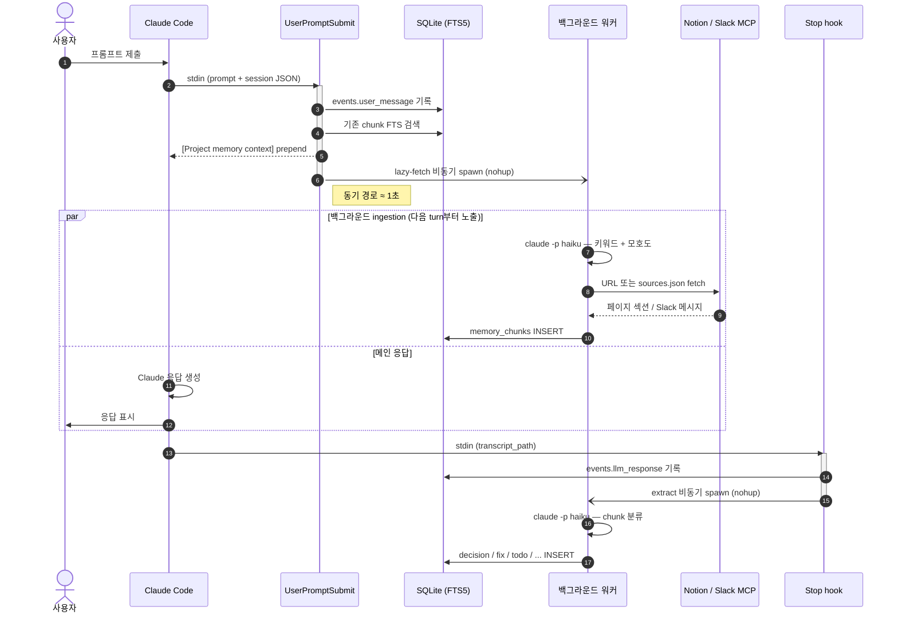

# imprint — Claude Code plugin

로컬 작업 기억(SQLite + FTS5), 외부 소스(Slack · Notion) lazy-fetch, advisor orchestration, statusline HUD를 Claude Code의 hook · skill · subagent 시스템으로 제공하는 plugin입니다.

> 이 repo는 `imprint`로 리네임되었습니다. 이전 정체성이었던 Tauri 데스크톱 앱 청사진(코드명 `multi-agent-cli-v2`)과 더 이전 세대 SwiftUI 앱(`MultiAgentCLI`)은 **폐기되었습니다.** 본 repo는 Claude Code plugin 단일 책임을 가집니다. 이전 SwiftUI 앱이 필요하다면 [`MultiAgentCLI`](../MultiAgentCLI) 원본 repo를 참고하세요.

## 무엇을 하는가

| 영역 | 역할 |
|---|---|
| Soul (persona) | `SessionStart` hook이 `<project>/.imprint/soul.md` 내용을 컨텍스트 시작에 prepend. 압축 후에도 `compact` matcher로 자동 재주입 |
| Routing | `UserPromptSubmit` hook이 `<project>/.imprint/UserPromptSubmit.md`의 키워드 → agent 룰을 평가, 매칭 시 권고 메시지 prepend (예: "PR" → `pr-agent` 호출 권고) |
| Memory | 프롬프트·응답·외부 소스를 `~/.claude/imprint/app.sqlite`에 누적, FTS5 trigram으로 한국어 부분일치 검색. 매 prompt마다 관련 chunk를 `[Project memory context]` 블록으로 자동 prepend |
| Advisor | `codex`, `gemini`를 advisor로 호출하고 `claude -p`로 합성. 각 호출은 `provider_runs`에 기록 |
| HUD | Claude Code statusline에 `5h: 25% (1h 49m) │ wk: 3% (1d 9h) │ ctx: 12% │ skills: 17 │ agents: 1` 형태로 잔여 시간과 활성 plugin의 skills/agents 수 표시 |

## 어떻게 동작하는가

매 turn마다 두 개의 hook이 **동기·비동기 두 경로**로 작동합니다. 동기 경로는 사용자 turn을 막지 않도록 ≈1초 안에 끝나고, LLM 호출(`claude -p haiku`)·외부 fetch·chunk 추출 같은 무거운 작업은 전부 백그라운드로 분리됩니다.

### 전체 플로우



### UserPromptSubmit (프롬프트 진입 직전)

| 경로 | 동작 |
|---|---|
| 동기 (≈1초) | `events.user_message` 기록 → 기존 chunk FTS 검색 → `[Project memory context]` 블록 prepend |
| 비동기 (≈30~60초) | `claude -p haiku`로 키워드·모호도 추출 → prompt의 Notion/Slack URL 또는 `sources.json` 기반 lazy-fetch → 외부 chunk INSERT |

서브프로세스가 다시 hook을 타며 자기 자신을 spawn하는 무한 재귀는 `IMPRINT_BYPASS_HOOKS=1`을 환경에 박아 차단합니다.

### Stop (응답 종료 직후)

| 경로 | 동작 |
|---|---|
| 동기 | `events.llm_response`로 응답 텍스트 archive |
| 비동기 | `claude -p haiku`가 응답을 파싱해 9가지 chunk_type(`decision`·`error`·`fix`·`command`·`test_result`·`summary`·`todo`·`code_context`·`note`)으로 분류, `memory_chunks`에 누적 |

추출만 끄고 싶으면 `IMPRINT_DISABLE_EXTRACT=1`.

### 외부 소스 lazy-fetch (Notion · Slack)

prompt에 Notion/Slack URL이 들어 있거나 `<project>/.imprint/sources.json`에 등록된 채널·페이지가 있으면 백그라운드 워커가 사용자 환경의 read-only MCP로 가져와 섹션 단위로 chunk화합니다.

```json
{
  "slack": { "channels": ["#ios-payment", "#ios-bugs"] },
  "notion": { "pages": ["a1b2c3d4-payment-prd"] }
}
```

처리 규칙:

- **Notion 페이지** — 비-QA H1/H2/H3 heading을 각각 별도 chunk로 보존 (압축·front-truncation 금지, 히스토리 유지가 목적)
- **Slack thread** — 전체 reply를 가져와 prompt 관련 reply만 selection + summary로 압축 (1~3 chunk)
- **Slack 단일 메시지** — 1 chunk
- **dedup** — `metadata_json.url` 기준. 같은 URL은 재 fetch 자체를 skip
- **갱신** — TTL 무한, `/memory refresh <url|source slack|source notion|project>` 명시 명령으로만 갱신
- **graceful degradation** — `sources.json` 부재·MCP 다운·`claude -p` 실패 시 silent skip + 기존 prepend로 fallback

`IMPRINT_ALLOWED_TOOLS_FETCH`에 `mcp__notion__*,mcp__slack__*` 같은 와일드카드를 박아 사용자 환경의 read-only MCP 이름이 무엇이든 자동 인식하게 만들어 두었습니다.

### 운영 변수

| 변수 | 기본값 | 의미 |
|---|---|---|
| `IMPRINT_AMBIGUITY_THRESHOLD` | `0.5` | 이 값 이상이면 `[Refined prompt suggestion]` 블록을 prepend |
| `IMPRINT_CLAUDE_TIMEOUT_PREFILL` | `25` | 모호도 분석 `claude -p` 타임아웃(초) |
| `IMPRINT_CLAUDE_TIMEOUT_FETCH` | `45` | 외부 소스 fetch `claude -p` 타임아웃(초) |
| `IMPRINT_CLAUDE_TIMEOUT_EXTRACT` | `30` | Stop chunk 추출 `claude -p` 타임아웃(초) |
| `IMPRINT_CLAUDE_BIN` | `claude` | 사용할 claude CLI 경로 |
| `IMPRINT_BYPASS_HOOKS` | `0` | `1`이면 hook이 즉시 종료 (재귀 가드, 백그라운드 서브프로세스에 자동 주입) |
| `IMPRINT_DISABLE_EXTRACT` | `0` | `1`이면 Stop hook의 chunk 추출만 비활성 |
| `IMPRINT_ALLOWED_TOOLS_FETCH` | (Notion·Slack 와일드카드) | fetch `claude -p`에 전달할 `--allowed-tools` 값 |
| `IMPRINT_NO_SEED` | `0` | `1`이면 SessionStart의 `.imprint/` 시드 비활성 |

Phase 정의·아키텍처 결정 이력·미시작 단계는 [`LoadMap.md`](LoadMap.md), 다음 세션 픽업 안건은 [`HANDOFF.md`](HANDOFF.md).

## 설치

자세한 절차는 [`INSTALL.md`](INSTALL.md). 요약:

```bash
# 이 repo가 marketplace로 등록되어 있다면
claude plugin marketplace add <this-repo>
claude plugin install imprint@imprint
```

설치 후 Claude Code 세션을 새로 열면 `SessionStart` hook이 SQLite 스키마를 idempotent하게 생성하고 프로젝트 row를 upsert합니다.

statusline 활성화는 별도 단계입니다.

```bash
bash scripts/imprint/hud-setup.sh install         # 기존 statusLine 백업 후 교체
bash scripts/imprint/hud-setup.sh layout focused  # minimal | focused | full
bash scripts/imprint/hud-setup.sh uninstall       # 백업 복원
```

## 사용

### Memory

```bash
imprint memory remember "Claude Code plugin 전환 결정"  # 수동 저장
imprint memory search "PTY 한글 IME"                   # FTS5 검색
imprint memory pin <chunk-id>                          # 우선 노출
imprint memory list --recent --limit 20
imprint memory refresh <url|source slack|source notion|project>  # 외부 chunk 갱신
```

`UserPromptSubmit` hook이 매 prompt마다 pinned + recent 청크를 `[Project memory context]` 블록으로 자동 prepend합니다.

### Routing (옵션)

`UserPromptSubmit` hook은 `<project>/.imprint/UserPromptSubmit.md`(없으면 plugin defaults)에서 라우팅 표를 읽어 매칭된 권고를 prepend합니다. 본 plugin은 라우팅 룰 markdown을 ship하지 않으므로, 사용하려면 사용자가 다음 형식으로 직접 작성합니다.

```markdown
| 패턴                       | Agent      | 권고 메시지                  |
|---------------------------|------------|------------------------------|
| `\b(PR\|pull\s*request)\b` | pr-agent   | PR 작업 — pr-agent 호출 권장 |
```

작성 시 주의:
- 한국어 키워드엔 `\b` 사용 금지(한글이 word character로 인식되어 boundary 안 잡힘) — 영어 약어에만 `\b`.
- 정규식 alternation `|`는 `\|`로 escape — markdown 셀 구분자와 충돌하기 때문.
- 매칭된 agent가 실제 호출되려면 해당 subagent 정의가 plugin 또는 사용자 영역에 등록돼 있어야 합니다.

### Advisor

`/advisor <질문>` 같이 skill로 호출하면 codex/gemini를 병렬 advisor로 돌리고 합성된 답변을 반환합니다. 단일 advisor만 쓰려면 `--advisor codex` 식으로 지정.

### HUD

statusline은 `hud-setup.sh install` 이후 자동 갱신됩니다. 데이터는 Claude Code가 매 갱신마다 stdin으로 넘기는 세션 JSON(`rate_limits.*.resets_at`, `context_window.used_percentage` 등)을 그대로 사용합니다.

## 구조

```
.claude-plugin/
  plugin.json              플러그인 매니페스트
  marketplace.json         로컬 marketplace entry
hooks/hooks.json           SessionStart / UserPromptSubmit / Stop 등록
skills/
  memory/SKILL.md
  advisor/SKILL.md
  hud/SKILL.md
prompts/defaults/          첫 SessionStart에서 <project>/.imprint/로 시드되는 기본 콘텐츠
  soul.md                  persona·동작 규칙
  UserPromptSubmit.md      라우팅 룰 기본값
  sources.json             Slack 채널·Notion 페이지 설정 기본값
  hooks/                   활성 listener 3종 reference doc (SessionStart / UserPromptSubmit / Stop)
scripts/imprint/
  lib/common.sh            DB·project·로그 헬퍼
  lib/schema.sql           SQLite 스키마 (FTS5 trigger 포함)
  lib/migrations.sh        FTS5 trigram tokenizer 마이그레이션
  lib/ingestion.py         lazy-fetch · prefill · extract · refresh 단일 모듈 (claude -p haiku 호출)
  session-start.sh         SessionStart hook (DB 보장 + .imprint/ 시드 + soul.md emit)
  user-prompt-submit.sh    UserPromptSubmit hook (라우팅 평가 + 메모리 주입 + bg lazy-fetch)
  stop.sh                  Stop hook (assistant 응답 archive + bg chunk extract)
  memory.sh                /memory dispatcher
  advisor.sh               /advisor dispatcher
  hud.sh                   statusline body
  hud-setup.sh             statusLine install/status/uninstall/layout
INSTALL.md                 설치 가이드
LifeCycle.md               LLM 턴 생애주기 ↔ Claude Code hook 매핑 + 깊이 있는 카탈로그
LoadMap.md                 큰 그림 — 비전·Phase·위험 요소·최종 목표
HANDOFF.md                 단기 — 다음 세션 픽업 · deferred TODO · 미완 Phase
```

## 데이터 위치

| 경로 | 내용 |
|---|---|
| `<project>/.imprint/soul.md` | 세션 시작·압축 후 자동 prepend되는 persona·동작 규칙. 사용자 자유 편집. (plugin defaults에서 자동 시드) |
| `<project>/.imprint/UserPromptSubmit.md` | 매 prompt마다 평가되는 키워드 → agent 라우팅 룰. 사용자 자유 편집. |
| `<project>/.imprint/sources.json` | lazy-fetch 대상 Slack 채널·Notion 페이지 정의. 비어 있어도 plugin 동작. |
| `<project>/.imprint/hooks/*.md` | 본 plugin이 등록한 활성 listener 3종(SessionStart / UserPromptSubmit / Stop) 가이드. Claude Code가 직접 읽진 않는 사람용 참고 문서. |
| `~/.claude/imprint/app.sqlite` | projects · conversations · events · memory_chunks · provider_runs (FTS5 포함) |
| `~/.claude/imprint/plugin.log` | hook · dispatcher 로그 |
| `~/.claude/imprint/previous-statusline.json` | hud-setup install 시 백업된 이전 statusLine 설정 |

`.imprint/` 폴더는 SessionStart hook이 처음 실행될 때 자동 생성되며 기존 파일은 절대 덮어쓰지 않습니다. 시드를 막고 싶다면 `IMPRINT_NO_SEED=1`.

## 의존

- `bash`, `python3`, `sqlite3`, `uuidgen` (macOS 기본 포함)
- 사용할 provider CLI(`claude`, `codex`, `gemini`)는 별도 설치·인증 필요
- Notion/Slack lazy-fetch를 쓰려면 사용자 환경에 read-only MCP가 등록돼 있어야 함

## 진행 상황·로드맵

- 큰 그림 (비전·Phase 정의·위험 요소·최종 목표): [`LoadMap.md`](LoadMap.md)
- 단기 픽업 (즉시 다음 검토·deferred TODO·미완 Phase): [`HANDOFF.md`](HANDOFF.md)
- LLM 턴 생애주기와 Claude Code hook 활용 카탈로그: [`LifeCycle.md`](LifeCycle.md)
