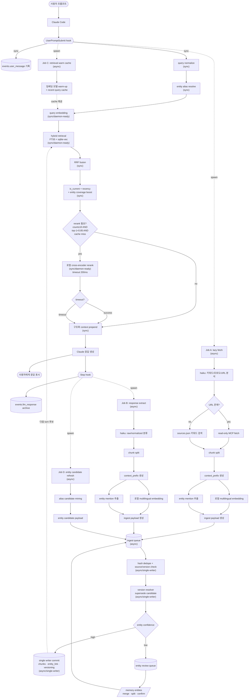

# imprint — Claude Code plugin

로컬 작업 기억(SQLite + FTS5), 외부 소스(Slack · Notion) lazy-fetch, statusline HUD를 Claude Code의 hook · skill · subagent 시스템으로 제공하는 plugin입니다.

## 설치

자세한 절차는 [`INSTALL.md`](INSTALL.md). 요약:

```bash
# 이 repo가 marketplace로 등록되어 있다면
claude plugin marketplace add <this-repo>
claude plugin install imprint@imprint
```

설치 후 Claude Code 세션을 새로 열면 `SessionStart` hook이 SQLite 스키마를 idempotent하게 생성합니다.

## 무엇을 하는가

| 영역 | 역할 |
|---|---|
| Soul (persona) | `SessionStart` hook이 `<project>/.imprint/soul.md` 내용을 컨텍스트 시작에 prepend. 압축 후에도 `compact` matcher로 자동 재주입 |
| Routing | `UserPromptSubmit` hook이 `<project>/.imprint/UserPromptSubmit.md`의 키워드 → agent 룰을 평가, 매칭 시 권고 메시지 prepend |
| Memory | 프롬프트·응답·외부 소스를 `~/.claude/imprint/app.sqlite`에 누적, FTS5 trigram으로 한국어 부분일치 검색. 매 prompt마다 관련 chunk를 `[Project memory context]` 블록으로 자동 prepend |
| HUD | Claude Code statusline에 `5h: 25% (1h 49m) │ wk: 3% (1d 9h) │ ctx: 12% │ skills: 17 │ agents: 1` 형태로 잔여 시간과 활성 plugin의 skills/agents 수 표시 |

## 어떻게 동작하는가

매 turn마다 두 개의 hook이 **동기·비동기 두 경로**로 작동합니다. 동기 경로는 사용자 turn을 막지 않도록 ≈1초 안에 끝나고, LLM 호출(`claude -p haiku`)·외부 fetch·chunk 추출 같은 무거운 작업은 전부 백그라운드로 분리됩니다.

### 전체 플로우

```
사용자:
  "Notion https://notion.so/feature-spec 보고,
   A 버튼 클릭 동작 알려줘"

[동기 경로 — 2.3초]
  1. QN: "A 버튼" "클릭" "동작" 정규화
  2. SC: scope=local (특정 버튼 세부사항)
  3. RES: "A 버튼" → entity_456
  4. QEMB: query embedding 생성 (warm cache 활용)
  5. HYB1: chunk retrieval (local 질문)
     - FTS: 40개
     - vector: 40개
  6. RRF: 융합 후 50개
  7. BOOST: is_current × recency × entity → 12개
  8. RG: count≥10, top-1<0.85 → rerank 실행
  9. RR: cross-encoder → 6개 선택
  10. GROUND: chunk만 있으므로 skip
  11. CCHECK: entity_456 conflict 없음
  12. CTX: context prepend
  13. RESP: Claude 응답 생성
  14. USR: "A 버튼 클릭 시 handleButtonA() 호출..."

[비동기 경로 — 백그라운드]
  Job A (lazy fetch):
    1. ANL: Haiku가 URL 추출
    2. FETCH: Notion MCP로 페이지 내용 가져옴
    3. SPL1: 청크 분할 (3개 chunk 생성)
    4. CP1: context_prefix 생성
    5. EMB1: 임베딩 생성
    6. ENT1: entity 추출 ("A 버튼", "handleButtonA")
    7. PACK1 → ENQ

  Job B (response extract):
    1. EX: Haiku가 응답 분류
    2. SPL2 → CP2 → EMB2 → ENT2 → PACK2 → ENQ

  [Ingest Queue 처리]
    1. DEDUPE: hash 체크 (PACK1, PACK2 중복 없음)
    2. VRES: 기존 chunk_old를 supersede 판정
       → chunk_old.is_current = false
    3. CONF: entity confidence high → W1
    4. W1: single writer commit
       - 3개 chunk insert
       - entity_link 생성
       - chunk_old superseded_by 갱신
    5. W1 완료 후:
       - changed_entities = ["button_A", "handleButtonA"]
       - trigger J5 (summary rebuild)
       
  Job E (summary rebuild):
    1. SMTRIG: "login_flow" feature 영향받음
    2. SMGEN: feature summary 재생성
    3. SMEMB: summary embedding
    4. PACK4 → ENQ → W1

다음 질문:
  사용자: "로그인 흐름 전체 알려줘"
  
  [동기 경로]
    1. SC: scope=feature
    2. HYB2: feature summary retrieval
       - "login_flow" summary 검색 (방금 rebuild됨)
       - summary_links로 drill-down chunk 3개
    3. GROUND: summary + 근거 chunk 3개
    4. RESP: "로그인 흐름은 A 버튼 클릭으로 시작..."
```

## hook


| hook | 시점 | 동기 경로 | 비동기 경로 |
|---|---|---|---|
| **UserPromptSubmit** | 프롬프트 진입 직전 | `events.user_message` 기록 → 기존 chunk FTS 검색 → `[Project memory context]` 블록 prepend (≈1 초) | `claude -p haiku` 로 키워드·모호도 추출 → prompt 의 Notion/Slack URL 또는 `sources.json` 기반 lazy-fetch → 외부 chunk INSERT (≈30~60 초) |
| **Stop** | 응답 종료 직후 | `events.llm_response` 로 응답 텍스트 archive | `claude -p haiku` 가 응답을 9 가지 `chunk_type` (`decision` · `error` · `fix` · `command` · `test_result` · `summary` · `todo` · `code_context` · `note`) 로 분류해 `memory_chunks` 에 누적. 외부 source (Slack · Notion) 는 ingestion 경로에서 `spec` · `message` · `thread` 로 직접 INSERT |

서브프로세스가 다시 hook 을 타며 자기 자신을 spawn 하는 무한 재귀는 `IMPRINT_BYPASS_HOOKS=1` 을 환경에 박아 차단합니다.

### 외부 소스 lazy-fetch (Notion · Slack)

`<project>/.imprint/sources.json` 에 등록된 채널·페이지, 또는 prompt 안에 직접 들어온 Notion/Slack URL 을 백그라운드 워커가 read-only MCP 로 가져와 섹션 단위로 chunk 화합니다.

```json
{
  "slack": { "channels": ["#ios-payment", "#ios-bugs"] },
  "notion": { "pages": ["a1b2c3d4-payment-prd"] }
}
```

sectioning 룰 · dedup · TTL · graceful degradation 명세는 [`flow.md`](flow.md) "외부 소스 lazy-fetch 처리 룰" 참조. 시스템 도구·운영 환경 변수·실패 모드 매핑도 같은 문서. 동기 경로의 미래 병목 후보(transcript 재파싱·외부 fetch payload·동시 백그라운드 부하) 와 단계적 대응 플랜은 [`HANDOFF.md`](HANDOFF.md) "성능 병목 진단 — 3축" 참조.

## Phase 7a — 검색 정밀도 (1단계)

[`HANDOFF.md`](HANDOFF.md) **Phase 7a (1단계 — 검색을 잘하게 만든다)** 의 런타임 플로우입니다. 위 본 플로우의 단일 `SEARCH` 노드를 hybrid retrieval 파이프라인(`QN → RES → QEMB → HYB → RRF → BOOST → RG → (RR → RROK)? → CTX`) 으로 펼치고, 두 hook 의 백그라운드 ingestion 을 single-writer queue 로 통합한 구조입니다. 각 PR 이 머지될 때마다 본 플로우의 해당 노드가 7a 노드로 교체됩니다.

다이어그램의 핵심 메시지는 두 가지입니다:

1. **동기 부담 통제 — `RG{rerank 필요?}` 게이트 + RR timeout graceful** — 동기 경로는 `count≥10 AND top-1<0.85 AND cache miss` 셋이 모두 성립할 때만 cross-encoder rerank 를 발동, 그 외엔 BOOST 결과를 곧바로 prepend. rerank 발동 시에도 `timeout 200 ms` 안에 못 끝나면 boost 결과로 graceful degradation. 무거운 단계(`QEMB`, `HYB`, `RR`)는 `(sync/daemon-ready)` 라벨로 표기 — daemon 분리 후보.
2. **write 경합 소멸 — single-writer ingest queue** — 두 hook 의 백그라운드(`J1`/`J2`/`J4`) 가 모두 `PACK*` 만 만들어 같은 `ENQ` 큐로 보내고, `DEDUPE → VRES → CONF → W1` 한 줄로 직렬 commit. 이전 성능 병목 진단의 영구 deferred 였던 "단일 writer 큐"가 7a 의 자연 일부로 흡수됨.

추가로 `J3 → WC → QEMB` 의 cache 제공 dotted edge 가 query embedding 의 콜드 로드 비용을 흡수하고, `W2 → ENTS → ENQ` 의 review queue 순환이 entity confirm 결과를 같은 single-writer 트랜잭션 흐름에 다시 태웁니다.



### 노드 라벨 분류

| 라벨 | 의미 | 노드 |
|---|---|---|
| `(sync)` | 사용자 turn 동기 경로, 추가 지연 가벼움 | `LOG` · `QN` · `RES` · `RRF` · `BOOST` · `CTX` · `LOG2` |
| `(sync/daemon-ready)` | 동기 경로지만 무거운 후보 — daemon 분리 1순위 | `QEMB` · `HYB` · `RR` |
| `(async)` | 백그라운드 spawn, 사용자 turn 차단 없음 | `J1` · `J2` · `J3` · `J4` 와 그 하위 모든 노드 |
| `(async/single-writer)` | 모든 ingest 경로가 직렬화되는 단일 writer | `DEDUPE` · `VRES` · `W1` |

### 본 플로우와의 차이 — 핵심 변화

| 영역 | 본 플로우 | Phase 7a 적용 후 |
|---|---|---|
| Retrieval | `SEARCH` 단일 노드 (FTS5 trigram) | `QN → RES → QEMB → HYB → RRF → BOOST → RG{?} → (RR → RROK)? → CTX` 7~9 단계, RG 게이트로 rerank 조건부, RROK 로 timeout graceful |
| Ingest | 두 hook 이 각자 INSERT (write 경합 가능) | `J1/J2/J4 → PACK* → ENQ → DEDUPE → VRES → CONF → W1` single-writer queue 직렬 commit |
| Chunking | `claude haiku` 분류 후 단일 INSERT | `SPL → CP → (EMB ‖ ENT)` 분기 후 `PACK` 합성 |
| 임베딩 | 없음 | `QEMB` (query) · `EMB1/EMB2` (chunk) — 로컬 multilingual, J3 warm cache 제공 |
| Entity | 없음 | `RES` (resolve) + `ENT1/ENT2` (mention 추출) + `EA` (alias mining) + `CONF` 분기 + `W2` review queue |
| Versioning | `pinned` 만 | `VRES` 가 supersede 후보 결정, `W1` 이 versioning 컬럼 갱신 |
| 새 skill | — | `/memory entities` (review queue 검토 / merge / split / confirm) |
| 명령 갱신 | — | `/memory remember --supersedes <id>` 인자 추가 |
| daemon 분리 | 해당 없음 | `(sync/daemon-ready)` 3개 + warm cache 가 daemon 후보. inline-first + abstraction 만 박아 두고 latency budget 위반 시 daemon 으로 |

### 동기 경로 latency budget

| rerank 발동 여부 | budget | 구성 |
|---|---|---|
| skip (RG = no) | < 100 ms | QN(<5) + RES(<5) + QEMB(50~100, warm cache hit 시 <5) + HYB(30~80) + RRF(<1) + BOOST(<5) + CTX(<5) |
| 발동 (RG = yes) | < 300 ms | + RR(≤200, timeout) — timeout 시 200 ms 직후 RROK→CTX |

위 추정치를 위반하면 결정 #6 (Hosting) 의 daemon backend 로 `QEMB` / `HYB` / `RR` 를 분리하는 것이 첫 escape hatch. 자세한 budget 검증 절차는 [`HANDOFF.md`](HANDOFF.md) Phase 7a 의 "동기 경로 latency budget" 참조.

## Phase 7b — 프로젝트 수준 해석 (2단계)

[`HANDOFF.md`](HANDOFF.md) **Phase 7b (2단계 — 검색된 결과를 프로젝트 수준에서 해석하게 만든다)** 의 런타임 플로우입니다. 7a 의 hybrid retrieval 위에 **질문 해상도에 맞는 요약 계층** + **충돌 감지 계층** 을 얹은 구조이며, 7a 가 모두 머지된 뒤 진입합니다.

다이어그램의 핵심 메시지는 네 가지입니다:

1. **Multi-resolution retrieval — scope-aware routing** — `SC → SCOPE` 분기로 local / feature / global 질문이 서로 다른 retrieval 경로를 탐. local 은 chunk 중심 (7a 와 동일), feature 는 feature summary + drill-down chunks, global 은 project / document summary + 대표 항목. depth limit 이 라벨에 명시되어 context 폭주 방지.
2. **Grounding + contradiction awareness — 동기 경로 확장** — `GROUND` 가 summary 검색 결과면 `summary_links` 따라 근거 chunk 1~3개를 drill-down 하고, `CCHECK` 가 retrieved entity 의 `confirmed` contradiction 을 read-only 조회해 context 에 표시. 둘 다 가벼운 DB 조회.
3. **Incremental rebuild — `W1` commit trigger** — `J5 (summary rebuild)` 와 `J6 (contradiction detection)` 가 `ST` 가 아니라 `W1 -.변경 발생 시 trigger.-> J5/J6` 로 발동. 매 turn 무조건 재생성이 아니라 single-writer commit 에서 실제 entity / feature / decision 변경이 있을 때만.
4. **Cautious conflict handling — neutral 저장** — `CDCONF` 의 score 구간이 high / mid / low 셋. high 는 `status=candidate`, mid·low 는 `status=neutral` 로 저장. NLI 가 애매하게 판단한 쌍은 영구 dismiss 하지 않고 재검토 가능 — false negative 영구 손실 방지.

```mermaid
%%{init: {'flowchart': {'useMaxWidth': false, 'rankSpacing': 80, 'nodeSpacing': 50}, 'theme': 'default'}}%%
flowchart TB
    U([사용자 프롬프트]) --> CC[Claude Code]
    CC --> UPS{{UserPromptSubmit hook}}

    UPS -->|sync| LOG[("events.user_message 기록")]
    UPS -->|sync| QN["query normalize<br/>(sync)"]
    QN --> SC["scope classifier<br/>local/feature/global<br/>(sync)"]
    SC --> RES["entity alias resolve<br/>(sync)"]
    RES --> QEMB["query embedding<br/>(sync/daemon-ready)"]

    QEMB --> SCOPE{query scope}

    SCOPE -->|local| HYB1["chunk retrieval<br/>FTS5 + sqlite-vec<br/>(sync/daemon-ready)"]
    SCOPE -->|feature| HYB2["feature summary retrieval<br/>+ drill-down chunks<br/>max: summary 5 + chunk 8<br/>(sync/daemon-ready)"]
    SCOPE -->|global| HYB3["project/document summary retrieval<br/>+ key summaries<br/>max: proj 1 + doc 3 + feat 5 + chunk 6<br/>(sync/daemon-ready)"]

    HYB1 --> RRF1["RRF fusion<br/>(sync)"]
    HYB2 --> RRF2["RRF fusion<br/>(sync)"]
    HYB3 --> RRF3["RRF fusion<br/>(sync)"]

    RRF1 --> BOOST["is_current + recency<br/>+ entity coverage boost<br/>(sync)"]
    RRF2 --> BOOST
    RRF3 --> BOOST

    BOOST --> RG{"rerank 필요?<br/>count≥10 AND<br/>top-1<0.85 AND<br/>cache miss"}
    RG -->|yes| RR["로컬 cross-encoder rerank<br/>(sync/daemon-ready)<br/>timeout 200ms"]
    RG -->|no| GROUND["grounding check<br/>summary면 summary_links로<br/>근거 chunk 1~3개 drill-down<br/>(sync)"]
    RR --> RROK{timeout?}
    RROK -->|success| GROUND
    RROK -->|timeout| GROUND

    GROUND --> CCHECK["contradiction check<br/>retrieved entity의<br/>confirmed conflict 조회<br/>(sync)"]
    CCHECK --> CTX["구조화 context prepend<br/>+ conflict 표시<br/>(sync)"]
    CTX --> RESP["Claude 응답 생성"]
    RESP --> USR([사용자에게 응답 표시])

    RESP --> ST{{Stop hook}}
    ST --> LOG2[("events.llm_response archive")]

    UPS -.spawn.-> J1["Job A: lazy fetch<br/>(async)"]
    ST  -.spawn.-> J2["Job B: response extract<br/>(async)"]
    UPS -.spawn.-> J3["Job C: retrieval warm cache<br/>(async)"]
    ST  -.spawn.-> J4["Job D: entity candidate refresh<br/>(async)"]

    J3 --> WC["임베딩 모델 warm-up<br/>+ recent query cache"]
    WC -.cache 제공.-> QEMB

    J1 --> ANL["haiku: 키워드/모호도/URL 분석"]
    ANL --> URL{URL 존재?}
    URL -->|yes| FETCH["read-only MCP fetch"]
    URL -->|no| KW["sources.json 키워드 검색"]
    FETCH --> SPL1[chunk split]
    KW --> SPL1

    J2 --> EX["haiku: raw/normalized 분류"]
    EX --> SPL2[chunk split]

    SPL1 --> CP1[context_prefix 생성]
    SPL2 --> CP2[context_prefix 생성]

    CP1 --> EMB1[로컬 multilingual embedding]
    CP2 --> EMB2[로컬 multilingual embedding]

    CP1 --> ENT1[entity mention 추출]
    CP2 --> ENT2[entity mention 추출]

    J4 --> EA[alias candidate mining]

    EMB1 --> PACK1[ingest payload 생성]
    ENT1 --> PACK1
    EMB2 --> PACK2[ingest payload 생성]
    ENT2 --> PACK2
    EA --> PACK3[entity candidate payload]

    PACK1 --> ENQ[("ingest queue<br/>(async)")]
    PACK2 --> ENQ
    PACK3 --> ENQ

    ENQ --> DEDUPE["hash dedupe + source/version check<br/>(async/single-writer)"]
    DEDUPE --> VRES["version resolver<br/>supersede candidate<br/>(async/single-writer)"]
    VRES --> RTYPE{record type}
    RTYPE -->|chunk/entity| CONF{entity confidence}
    RTYPE -->|summary| W1
    RTYPE -->|contradiction| W1
    CONF -->|high| W1[("single writer commit<br/>chunks · summaries · contradictions<br/>entity_link · versioning<br/>(async/single-writer)")]
    CONF -->|low| W2[("entity review queue")]

    W1 -.변경 발생 시 trigger.-> J5["Job E: summary rebuild<br/>(async)"]
    W1 -.변경 발생 시 trigger.-> J6["Job F: contradiction detection<br/>(async)"]

    J5 --> SMTRIG["변경 영향 범위 계산<br/>feature/document/project"]
    SMTRIG --> SMGEN["상향식 summary 생성<br/>chunk→feature→document→project"]
    SMGEN --> SMEMB["summary embedding + FTS"]

    J6 --> CDCAND["contradiction candidate 생성<br/>same entity + decision type<br/>+ current/recent<br/>+ time gap < 90d"]
    CDCAND --> CDJUDGE["NLI 또는 LLM judge<br/>entail/contradict/neutral<br/>timeout 500ms"]
    CDJUDGE --> CDCONF{score 구간}
    CDCONF -->|high| PACK5_CAND["contradiction candidate payload<br/>status=candidate"]
    CDCONF -->|mid| PACK5_NEUT["contradiction neutral payload<br/>status=neutral<br/>재검토 가능"]
    CDCONF -->|low| PACK5_NEUT

    SMEMB --> PACK4[summary payload]
    PACK5_CAND --> ENQ
    PACK5_NEUT --> ENQ
    PACK4 --> ENQ

    W1 -.다음 turn 후보.-> QEMB
    W2 --> ENTS[/"memory entities<br/>merge · split · confirm"/]
    ENTS --> ENQ
```



### 1단계 (7a) 대비 변경점

| 요소 | 1단계 (7a) | 2단계 (7b) |
|---|---|---|
| 동기 시작 | `QN → RES` | `QN → SC → RES` |
| retrieval 분기 | `HYB` 단일 | `HYB1 / HYB2 / HYB3` scope 별 (depth limit 라벨) |
| context assembly | `CTX` | `GROUND` (summary_links drill-down) → `CCHECK` → `CTX` |
| 비동기 job 수 | 4 (A~D) | 6 (A~F, +`J5` summary rebuild, +`J6` contradiction detect) |
| job trigger | hook 직후 | `W1` commit 직후 변경 발생 시 (incremental) |
| ingest payload | 3종 | 5종 (+`PACK4` summary, +`PACK5_*` contradiction) |
| contradiction 처리 | — | high → `candidate`, mid·low → `neutral` (false negative 방지) |
| single-writer 대상 | chunks · entities | + summaries · contradictions |

### 동기 경로 latency 관리

7b 는 동기 경로에 `SC` · `SCOPE` 분기 · `GROUND` · `CCHECK` 4단계가 추가됩니다. 모두 가벼운 조회 / 분류 / 판정 로직이라 추가 지연은 **10~30 ms** 이내로 예상됩니다. 따라서 7a 의 latency budget (rerank skip < 100 ms, 발동 < 300 ms) 위에 30 ms 만 더 잡으면 됩니다.

다만 `HYB2` / `HYB3` 의 summary retrieval 정확도는 summary embedding 품질에 직결되므로 — chunk embedding 보다 신중하게 생성. 자세한 생성 규칙은 [`HANDOFF.md`](HANDOFF.md) Phase 7b 의 "feature / document / project summary 생성 규칙" 참조.

### 비동기 job 우선순위

| Job | 우선순위 | 이유 |
|---|---|---|
| `J2` response extract | 높음 | 다음 turn 에 즉시 영향 |
| `J1` lazy fetch | 높음 | 사용자가 명시한 source |
| `J5` summary rebuild | 중간 | feature 질문 대응 품질에 직결 |
| `J6` contradiction detection | 중간 | conflict 표시 품질에 영향 |
| `J4` entity refresh | 낮음 | 점진적 개선 |
| `J3` warm cache | 낮음 | 성능 보조 (콜드 로드 흡수) |


## 사용

### Memory

매 prompt마다 hook이 자동으로 prepend·누적하는 게 기본 흐름이고, `/memory ...` skill 은 그 흐름에 **수동 개입**할 때만 사용합니다. **모든 write 는 ingest queue 로 수렴** — `/memory remember`·`pin`·`refresh` 모두 직접 INSERT 가 아니라 payload 를 만들어 같은 큐로 보냅니다 (single-writer 보장 · dedupe · version race 차단).

```mermaid
%%{init: {'flowchart': {'useMaxWidth': false, 'rankSpacing': 80, 'nodeSpacing': 50}, 'theme': 'default'}}%%
flowchart LR
    UI[사용자 프롬프트 또는 /memory skill] --> H[UserPromptSubmit hook]

    H -->|동기 retrieval| QN[query normalize]
    QN --> RES[entity alias resolve]
    RES --> QEMB["query embedding<br/>warm cache 활용"]
    QEMB --> HYB["hybrid retrieval<br/>FTS5 + sqlite-vec"]
    HYB --> RRF[RRF fusion]
    RRF --> BOOST["is_current + recency<br/>+ entity coverage + pin_weight"]
    BOOST --> RG{rerank 필요?}
    RG -->|yes| RR["cross-encoder rerank<br/>timeout 200ms"]
    RG -->|no| CTX[구조화 context prepend]
    RR --> RROK{timeout?}
    RROK -->|success| CTX
    RROK -->|timeout| CTX
    CTX --> CC[Claude 응답]

    H -.비동기 spawn.-> BG["백그라운드 ingestion<br/>fetch + split + embed"]
    BG --> PACK1[ingest payload]

    REM[/"memory remember<br/>--supersedes 지원"/] --> PACK2["remember payload<br/>is_current=true"]
    PIN[/"memory pin<br/>--weight N"/] --> PACK3[pin update payload]
    REF[/"memory refresh<br/>source re-fetch"/] --> PACK4["refresh payload<br/>obsolete + new"]

    PACK1 --> ENQ[("ingest queue<br/>FIFO")]
    PACK2 --> ENQ
    PACK3 --> ENQ
    PACK4 --> ENQ

    ENQ --> DEDUPE["hash dedupe<br/>+ source/version check"]
    DEDUPE --> VRES["version resolver<br/>supersede 판정"]
    VRES --> CONF{entity confidence}
    CONF -->|high| W1[("single writer commit<br/>chunks + entity_link + versioning")]
    CONF -->|low| W2[(entity review queue)]

    W1 -.다음 turn 후보.-> HYB
    W2 --> ENTS[/"memory entities<br/>merge · split · confirm"/]
    ENTS --> ENQ
```



이 다이어그램은 **Phase 7a (1단계 — 검색을 잘하게) 적용 후의 Memory 동작** 입니다. Phase 7b (2단계) 가 추가되면 동기 경로 시작에 `SC` (scope classifier) + `HYB1/2/3` 분기 + `GROUND`/`CCHECK` 가 들어가고, 비동기에 `J5` (summary rebuild) + `J6` (contradiction detection) 가 추가됩니다 — 자세한 플로우는 위 **"Phase 7b — 프로젝트 수준 해석 (2단계)"** 섹션 참조.

#### 자연어 → 서브커맨드 매핑

`/memory` 뒤에 자연어로 의도를 표현하면 Claude 가 [`SKILL.md`](skills/memory/SKILL.md) 가이드를 보고 적절한 dispatcher 서브커맨드로 매핑합니다. 정확한 동작이 필요하면 `/memory <subcommand> <args>` 명시 호출도 그대로 받습니다. 요청이 모호하면 Claude 가 `stats` → `list --recent` → `search` / `show` 식 chain 으로 자연스럽게 좁힙니다.

| 자연어 예시 | dispatcher 서브커맨드 | 동작 · 효과 |
|---|---|---|
| `어제 결제 어떻게 처리했어?` | `search <query>` | FTS5 trigram 검색 — matching chunk 목록 (id · type · 발췌) |
| `이 chunk 자세히 보여줘 / metadata` | `show <id>` (`--json`) | 단일 chunk text + `metadata_json` 디버그 — 외부 source sectioning · `url` · `section_title` 확인 |
| `이걸 prompt 에 넣어` | `inject <id>` | chunk text 를 stdout 으로 — Claude Code 가 현재 turn 컨텍스트 포함 |
| `이거 기억해줘 / 결정 사항 저장` | `remember <text>` (`--type` / `--pin` / `--redact` / `--supersedes`) | 사용자 chunk 를 ingest queue 로 — 다음 turn 부터 검색·prepend 후보. `--redact` 는 정규식 룰셋으로 secret 마스킹 |
| `이 chunk 항상 위로 / pin 풀어` | `pin` / `unpin <id>` | pinned 플래그 토글 — `BOOST` 에서 우선 노출 |
| `최근 chunk / pinned 만 / 다른 프로젝트` | `list` (`--recent` · `--pinned` · `--type` · `--source` · `--since` · `--limit` · `--project`) | 필터링된 chunk 표. `--project` 는 절대경로 또는 id-prefix |
| `지금 뭐가 얼마나 쌓여 있어?` | `stats` (`--all` · `--json`) | 총 chunk 수 · `chunk_type` · `source` 분포 · 외부 unique URL 수 |
| `이거 잊어줘` (id 포함) | `forget <id>` | DB row + FTS 인덱스 영구 제거 (trigger 자동 동기) |
| `노션 페이지 갱신 / slack 다시 fetch` | `refresh <url\|source slack\|source notion\|project>` | 외부 chunk 무효화 + 다음 prefill 에 재 fetch (수동 trigger only) |

모든 write (`remember` · `pin` · `refresh` · `forget`) 는 ingest queue 를 거쳐 **single-writer commit** — race · 중복 · version 일관성 보장. `search` · `show` · `inject` · `list` · `stats` 는 read-only 라 큐를 거치지 않습니다. 자세한 payload 형태와 `DEDUPE → VRES → CONF → W1` 단계 명세는 [`HANDOFF.md`](HANDOFF.md) **"Phase 7a — 청크 + 의미 검색 + 엔티티 정규화 + 버전"** 참조.

`/memory remember` 로 사용자가 직접 박은 chunk 와 hook 이 응답에서 자동 추출한 chunk 는 같은 `memory_chunks` 테이블에 누적되어, 다음 turn 부터 동등한 자격으로 prefill 후보가 됩니다.


작성 시 주의:

- 한국어 키워드엔 `\b` 사용 금지 — 한글이 word character로 인식되어 boundary가 안 잡힘. `\b`는 영어 약어에만.
- 정규식 alternation `|`는 `\|`로 escape — markdown 셀 구분자와 충돌하기 때문.
- 매칭된 agent가 실제 호출되려면 해당 subagent 정의가 plugin 또는 사용자 영역에 등록돼 있어야 합니다.

