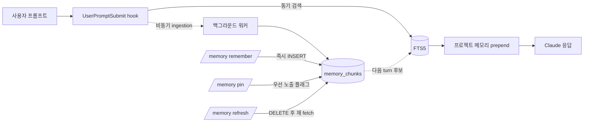

# imprint — Claude Code plugin

로컬 작업 기억(SQLite + FTS5), 외부 소스(Slack · Notion) lazy-fetch, statusline HUD를 Claude Code의 hook · skill · subagent 시스템으로 제공하는 plugin입니다.

> 이 repo는 `imprint`로 리네임되었습니다. 이전 정체성이었던 Tauri 데스크톱 앱 청사진(코드명 `multi-agent-cli-v2`)과 더 이전 세대 SwiftUI 앱(`MultiAgentCLI`)은 **폐기되었습니다.** 본 repo는 Claude Code plugin 단일 책임을 가집니다. 이전 SwiftUI 앱이 필요하다면 [`MultiAgentCLI`](../MultiAgentCLI) 원본 repo를 참고하세요.

## 무엇을 하는가

| 영역 | 역할 |
|---|---|
| Soul (persona) | `SessionStart` hook이 `<project>/.imprint/soul.md` 내용을 컨텍스트 시작에 prepend. 압축 후에도 `compact` matcher로 자동 재주입 |
| Routing | `UserPromptSubmit` hook이 `<project>/.imprint/UserPromptSubmit.md`의 키워드 → agent 룰을 평가, 매칭 시 권고 메시지 prepend |
| Memory | 프롬프트·응답·외부 소스를 `~/.claude/imprint/app.sqlite`에 누적, FTS5 trigram으로 한국어 부분일치 검색. 매 prompt마다 관련 chunk를 `[Project memory context]` 블록으로 자동 prepend |
| HUD | Claude Code statusline에 `5h: 25% (1h 49m) │ wk: 3% (1d 9h) │ ctx: 12% │ skills: 17 │ agents: 1` 형태로 잔여 시간과 활성 plugin의 skills/agents 수 표시 |

## 어떻게 동작하는가

매 turn마다 두 개의 hook이 **동기·비동기 두 경로**로 작동합니다. 동기 경로는 사용자 turn을 막지 않도록 ≈1초 안에 끝나고, LLM 호출(`claude -p haiku`)·외부 fetch·chunk 추출 같은 무거운 작업은 전부 백그라운드로 분리됩니다.

### 전체 플로우


### UserPromptSubmit (프롬프트 진입 직전)

| 경로 | 동작 |
|---|---|
| 동기 (≈1초) | `events.user_message` 기록 → 기존 chunk FTS 검색 → `[Project memory context]` 블록 prepend |
| 비동기 (≈30~60초) | `claude -p haiku`로 키워드·모호도 추출 → prompt의 Notion/Slack URL 또는 `sources.json` 기반 lazy-fetch → 외부 chunk INSERT |

서브프로세스가 다시 hook을 타며 자기 자신을 spawn하는 무한 재귀는 `IMPRINT_BYPASS_HOOKS=1`을 환경에 박아 차단합니다.

### Stop (응답 종료 직후)

| 경로 | 동작 |
|---|---|
| 동기 | `events.llm_response`로 응답 텍스트 archive |
| 비동기 | `claude -p haiku`가 응답을 9가지 chunk_type(`decision`·`error`·`fix`·`command`·`test_result`·`summary`·`todo`·`code_context`·`note`)으로 분류, `memory_chunks`에 누적. 외부 source(Slack·Notion)는 ingestion 경로에서 `spec`·`message`·`thread`로 직접 INSERT |

### 외부 소스 lazy-fetch (Notion · Slack)

prompt에 Notion/Slack URL이 들어 있거나 `<project>/.imprint/sources.json`에 등록된 채널·페이지가 있으면 백그라운드 워커가 사용자 환경의 read-only MCP로 가져와 섹션 단위로 chunk화합니다.

```json
{
  "slack": { "channels": ["#ios-payment", "#ios-bugs"] },
  "notion": { "pages": ["a1b2c3d4-payment-prd"] }
}
```

처리 규칙:

- **Notion 페이지** — 비-QA H1/H2/H3 heading을 각각 별도 chunk로 보존 (압축·front-truncation 금지, 히스토리 유지가 목적)
- **Slack thread** — 전체 reply를 가져와 prompt 관련 reply만 selection + summary로 압축 (1~3 chunk)
- **Slack 단일 메시지** — 1 chunk
- **dedup** — `metadata_json.url` 기준. 같은 URL은 재 fetch 자체를 skip
- **갱신** — TTL 무한, `/memory refresh <url|source slack|source notion|project>` 명시 명령으로만
- **graceful degradation** — `sources.json` 부재·MCP 다운·`claude -p` 실패 시 silent skip + 기존 prepend로 fallback

각 단계가 의존하는 시스템 도구·운영 환경 변수·실패 모드 매핑은 [`flow.md`](flow.md) 참조.

## 설치

자세한 절차는 [`INSTALL.md`](INSTALL.md). 요약:

```bash
# 이 repo가 marketplace로 등록되어 있다면
claude plugin marketplace add <this-repo>
claude plugin install imprint@imprint
```

설치 후 Claude Code 세션을 새로 열면 `SessionStart` hook이 SQLite 스키마를 idempotent하게 생성합니다.

statusline 활성화는 별도 단계입니다.

```bash
bash scripts/imprint/hud-setup.sh install         # 기존 statusLine 백업 후 교체
bash scripts/imprint/hud-setup.sh layout focused  # minimal | focused | full
bash scripts/imprint/hud-setup.sh uninstall       # 백업 복원
```

## 사용

### Memory

매 prompt마다 hook이 자동으로 prepend·누적하는 게 기본 흐름이고, `/memory ...` skill은 그 흐름에 **수동 개입**할 때만 사용합니다.



| 명령 | 동작 | 효과 |
|---|---|---|
| `/memory remember <text>` | 사용자가 직접 작성한 텍스트를 chunk로 즉시 INSERT | 다음 prompt부터 검색·prepend 대상 |
| `/memory search <query>` | FTS5 trigram 검색 | matching chunk 목록 표시 |
| `/memory pin <chunk-id>` | 우선 노출 플래그 ON | prefill 정렬에서 항상 위쪽 |
| `/memory list` (`--recent` / `--pinned` / `--type` / `--source`) | 누적 chunk 나열 | 필터링된 chunk 표 |
| `/memory refresh <url \| source slack \| source notion \| project>` | 외부 chunk 갱신 | DELETE → 재 fetch → INSERT |

`/memory remember`로 사용자가 직접 박은 chunk와 hook이 응답에서 자동 추출한 chunk가 같은 `memory_chunks` 테이블에 누적되어, 다음 turn부터 동등한 자격으로 prefill 후보가 됩니다.

### Routing (옵션)

`UserPromptSubmit` hook은 `<project>/.imprint/UserPromptSubmit.md`(없으면 plugin defaults)에서 라우팅 표를 읽어 매칭된 권고를 prepend합니다. 본 plugin은 라우팅 룰 markdown을 ship하지 않으므로 사용자가 다음 형식으로 직접 작성합니다.

```markdown
| 패턴       | Agent     | 권고 메시지   |
|-----------|-----------|---------------|
| `<regex>`  | <agent>   | <권고 텍스트> |
```

작성 시 주의:

- 한국어 키워드엔 `\b` 사용 금지 — 한글이 word character로 인식되어 boundary가 안 잡힘. `\b`는 영어 약어에만.
- 정규식 alternation `|`는 `\|`로 escape — markdown 셀 구분자와 충돌하기 때문.
- 매칭된 agent가 실제 호출되려면 해당 subagent 정의가 plugin 또는 사용자 영역에 등록돼 있어야 합니다.

### HUD

statusline은 `hud-setup.sh install` 이후 자동 갱신됩니다. 데이터는 Claude Code가 매 갱신마다 stdin으로 넘기는 세션 JSON(`rate_limits.*.resets_at`, `context_window.used_percentage` 등)을 그대로 사용합니다.

## 진행 상황·로드맵

- 큰 그림 (비전·Phase 정의·위험 요소·최종 목표): [`LoadMap.md`](LoadMap.md)
- 단기 픽업 (즉시 다음 검토·deferred TODO·미완 Phase): [`HANDOFF.md`](HANDOFF.md)
- 결정 사유 로그 (왜 그렇게 바꿨는지·폐기한 대안): [`HISTORY.md`](HISTORY.md)
- 동작 흐름 디테일·시스템 의존·운영 환경 변수: [`flow.md`](flow.md)
- LLM 턴 생애주기와 Claude Code hook 활용 카탈로그: [`LifeCycle.md`](LifeCycle.md)
