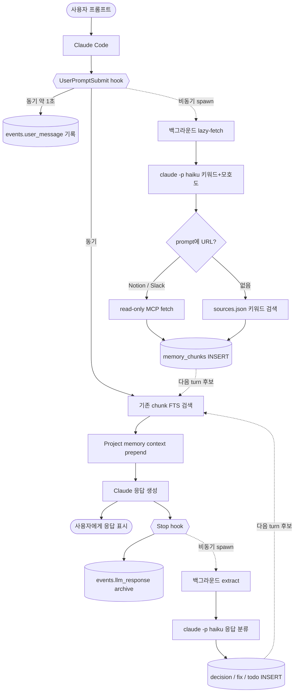
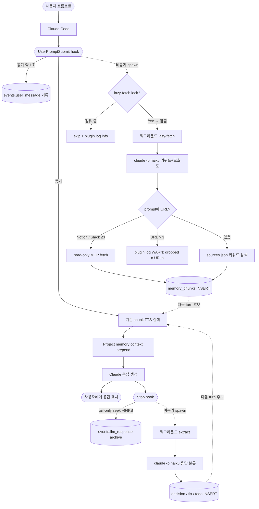
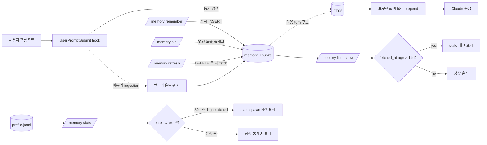
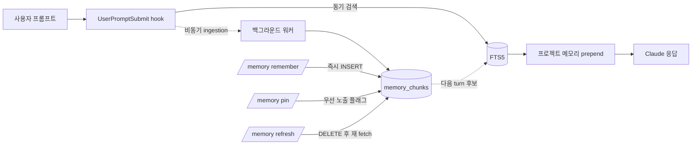

# imprint — Claude Code plugin

로컬 작업 기억(SQLite + FTS5), 외부 소스(Slack · Notion) lazy-fetch, statusline HUD를 Claude Code의 hook · skill · subagent 시스템으로 제공하는 plugin입니다.

## 무엇을 하는가

| 영역 | 역할 |
|---|---|
| Soul (persona) | `SessionStart` hook이 `<project>/.imprint/soul.md` 내용을 컨텍스트 시작에 prepend. 압축 후에도 `compact` matcher로 자동 재주입 |
| Routing | `UserPromptSubmit` hook이 `<project>/.imprint/UserPromptSubmit.md`의 키워드 → agent 룰을 평가, 매칭 시 권고 메시지 prepend |
| Memory | 프롬프트·응답·외부 소스를 `~/.claude/imprint/app.sqlite`에 누적, FTS5 trigram으로 한국어 부분일치 검색. 매 prompt마다 관련 chunk를 `[Project memory context]` 블록으로 자동 prepend |
| HUD | Claude Code statusline에 `5h: 25% (1h 49m) │ wk: 3% (1d 9h) │ ctx: 12% │ skills: 17 │ agents: 1` 형태로 잔여 시간과 활성 plugin의 skills/agents 수 표시 |

## 어떻게 동작하는가

매 turn마다 두 개의 hook이 **동기·비동기 두 경로**로 작동합니다. 동기 경로는 사용자 turn을 막지 않도록 ≈1초 안에 끝나고, LLM 호출(`claude -p haiku`)·외부 fetch·chunk 추출 같은 무거운 작업은 전부 백그라운드로 분리됩니다.

### 전체 플로우



### UserPromptSubmit (프롬프트 진입 직전)

| 경로 | 동작 |
|---|---|
| 동기 (≈1초) | `events.user_message` 기록 → 기존 chunk FTS 검색 → `[Project memory context]` 블록 prepend |
| 비동기 (≈30~60초) | `claude -p haiku`로 키워드·모호도 추출 → prompt의 Notion/Slack URL 또는 `sources.json` 기반 lazy-fetch → 외부 chunk INSERT |

서브프로세스가 다시 hook을 타며 자기 자신을 spawn하는 무한 재귀는 `IMPRINT_BYPASS_HOOKS=1`을 환경에 박아 차단합니다.

### Stop (응답 종료 직후)

| 경로 | 동작 |
|---|---|
| 동기 | `events.llm_response`로 응답 텍스트 archive |
| 비동기 | `claude -p haiku`가 응답을 9가지 chunk_type(`decision`·`error`·`fix`·`command`·`test_result`·`summary`·`todo`·`code_context`·`note`)으로 분류, `memory_chunks`에 누적. 외부 source(Slack·Notion)는 ingestion 경로에서 `spec`·`message`·`thread`로 직접 INSERT |

### 외부 소스 lazy-fetch (Notion · Slack)

prompt에 Notion/Slack URL이 들어 있거나 `<project>/.imprint/sources.json`에 등록된 채널·페이지가 있으면 백그라운드 워커가 사용자 환경의 read-only MCP로 가져와 섹션 단위로 chunk화합니다.

```json
{
  "slack": { "channels": ["#ios-payment", "#ios-bugs"] },
  "notion": { "pages": ["a1b2c3d4-payment-prd"] }
}
```

처리 규칙:

- **Notion 페이지** — 비-QA H1/H2/H3 heading을 각각 별도 chunk로 보존 (압축·front-truncation 금지, 히스토리 유지가 목적)
- **Slack thread** — 전체 reply를 가져와 prompt 관련 reply만 selection + summary로 압축 (1~3 chunk)
- **Slack 단일 메시지** — 1 chunk
- **dedup** — `metadata_json.url` 기준. 같은 URL은 재 fetch 자체를 skip
- **갱신** — TTL 무한, `/memory refresh <url|source slack|source notion|project>` 명시 명령으로만
- **graceful degradation** — `sources.json` 부재·MCP 다운·`claude -p` 실패 시 silent skip + 기존 prepend로 fallback

각 단계가 의존하는 시스템 도구·운영 환경 변수·실패 모드 매핑은 [`flow.md`](flow.md) 참조.

<!-- TEMP:bottleneck-mitigations 2026-05-09 — HANDOFF.md "성능 병목 진단 — 3축" 적용 후 합쳐 이 섹션은 제거 -->

## (임시) 대응안 적용 후 가상 플로우

이 섹션은 [`HANDOFF.md`](HANDOFF.md) "성능 병목 진단 — 3축" 의 대응안 4개가 모두 적용됐을 때의 **가상** 다이어그램입니다. 실제 코드는 아직 위의 본 플로우대로 동작하며, `IMPRINT_PROFILE=1` 측정 → 임계 도달 → 단계적 적용 흐름으로만 진행합니다. 모든 대응안이 머지되면 위 본 다이어그램과 병합하고 이 임시 섹션은 제거합니다.

반영된 대응안:

- **A1** — Stop hook 의 transcript 재파싱을 tail-only seek (~64 KB) 로 전환
- **B1** — `lazy_fetch` 의 `[:3]` cap 으로 잘려나간 URL 을 silent skip 대신 `plugin.log WARN` 으로 노출
- **B2** — `metadata_json.fetched_at` age > 14 d 인 chunk 는 `/memory list` / `/memory show` 가 `[stale]` 태그로 표시
- **C1** — UserPromptSubmit 의 백그라운드 spawn 직전에 `~/.claude/imprint/locks/lazy-fetch.lock` 게이트 — 이미 도는 spawn 이 있으면 그 turn 은 skip
- **C2** — `/memory stats` 가 `profile.jsonl` 의 enter ↔ exit 짝을 맞춰 30 s 초과 unmatched 를 "stale spawn" 으로 표시 (자동 kill 안 함)

### 전체 플로우 (가상)



기존 본 다이어그램과의 차이:

| 노드/엣지 | 본 플로우 | 가상 플로우 |
|---|---|---|
| UPS 비동기 spawn 진입 | 곧바로 BGF | `LOCK` 게이트 → 점유 중이면 SKIP, free 면 잠금 후 BGF |
| `URL?` 분기 | URL 있음 / 없음 두 갈래 | URL ≤3 fetch / URL > 3 점선 `WARN` 보조 가지 / 없음 KW |
| Stop → archive 엣지 | 라벨 없음 | `tail-only seek ~64KB` 라벨 |

### Memory 플로우 (가상)



기존 Memory 플로우와의 차이:

| 노드/엣지 | 본 플로우 | 가상 플로우 |
|---|---|---|
| `/memory list` / `show` | 다이어그램에 없음 | `DB → LIST → AGE` 분기 신설, age 임계 시 `[stale]` 태그 |
| `/memory stats` | 다이어그램에 없음 | `profile.jsonl → STATS → ZOMBIE` 분기 신설, unmatched enter 표시 |
| 자동 kill / 자동 refresh | — | **없음** (사용자가 보고 결정 — 외부 트래픽·정상 fetch 보호) |

### 적용 순서 — 단순한 순으로

1. **A1** (tail-only seek) — 임계 도달 신호: `stop.transcript_reparse.dur_ms` > 80 ms 두 번 이상
2. **B1** (URL cap warn) — 임계 도달 신호: `lazy_fetch dropped` 가 한 번이라도
3. **C1** (lazy-fetch lockfile) — 임계 도달 신호: 5분 윈도에 enter 만 있고 exit 없는 spawn 2건 이상
4. **C2** (`/memory stats` 좀비 표시) — C1 적용 후 자연스럽게
5. **B2** (fetched_at stale flag) — 측정 데이터로 14 d 임계 재조정한 뒤

각 항목은 적용 후 측정 비교 (계측 hook 그대로 유지) → 안정 확인 → 다음 항목 순으로 분리해 진행합니다. 더 자세한 사유·트레이드오프는 [`HANDOFF.md`](HANDOFF.md) "성능 병목 진단 — 3축" 참조.

## 설치

자세한 절차는 [`INSTALL.md`](INSTALL.md). 요약:

```bash
# 이 repo가 marketplace로 등록되어 있다면
claude plugin marketplace add <this-repo>
claude plugin install imprint@imprint
```

설치 후 Claude Code 세션을 새로 열면 `SessionStart` hook이 SQLite 스키마를 idempotent하게 생성합니다.

## 사용

### Memory

매 prompt마다 hook이 자동으로 prepend·누적하는 게 기본 흐름이고, `/memory ...` skill은 그 흐름에 **수동 개입**할 때만 사용합니다.



| 명령 | 동작 | 효과 |
|---|---|---|
| `/memory search <query>` | FTS5 trigram 검색 | matching chunk 목록(id·type·발췌) |
| `/memory show <chunk-id>` (`--json`) | 단일 chunk의 text + metadata 상세 | 외부 source가 어떻게 sectioning됐는지·`url`·`section_title` 같은 메타데이터 디버깅 |
| `/memory inject <chunk-id>` | chunk text를 stdout으로 출력 | Claude Code가 현재 turn 컨텍스트에 그대로 포함 |
| `/memory remember <text>` (`--type` / `--pin` / `--redact`) | 사용자가 직접 작성한 텍스트를 chunk로 즉시 INSERT | 다음 prompt부터 검색·prepend 대상. `--redact`는 정규식 룰셋으로 secret 마스킹 |
| `/memory pin` / `unpin <chunk-id>` | 우선 노출 플래그 토글 | pin은 prefill 정렬에서 항상 위쪽, unpin은 해제 |
| `/memory list` (`--recent` / `--pinned` / `--type` / `--source` / `--since <date>` / `--limit <n>` / `--project <path\|id-prefix>`) | 누적 chunk 나열 | 필터링된 chunk 표. `--project`로 다른 프로젝트도 검색 가능 |
| `/memory stats` (`--all` / `--json`) | 분포·통계 요약 | 총 chunk 수, chunk_type·source 분포, 외부 unique URL 수 |
| `/memory forget <chunk-id>` | chunk 영구 삭제 | DB row + FTS 인덱스 동시 제거(trigger 자동 동기화) |
| `/memory refresh <url \| source slack \| source notion \| project>` | 외부 chunk 갱신 | DELETE → 재 fetch → INSERT |

`/memory remember`로 사용자가 직접 박은 chunk와 hook이 응답에서 자동 추출한 chunk가 같은 `memory_chunks` 테이블에 누적되어, 다음 turn부터 동등한 자격으로 prefill 후보가 됩니다.


작성 시 주의:

- 한국어 키워드엔 `\b` 사용 금지 — 한글이 word character로 인식되어 boundary가 안 잡힘. `\b`는 영어 약어에만.
- 정규식 alternation `|`는 `\|`로 escape — markdown 셀 구분자와 충돌하기 때문.
- 매칭된 agent가 실제 호출되려면 해당 subagent 정의가 plugin 또는 사용자 영역에 등록돼 있어야 합니다.

