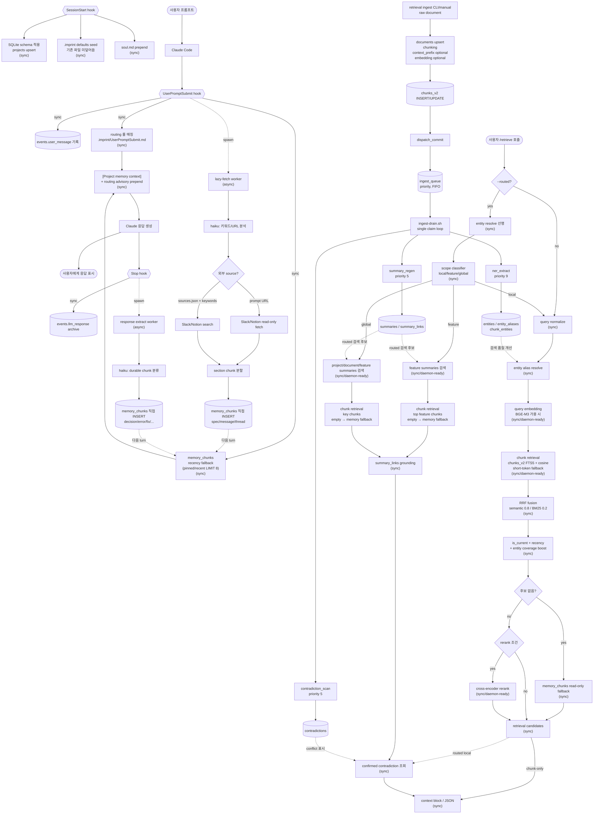

# imprint flow & dependencies

이 문서는 imprint 의 상세 동작 흐름을 설명합니다. 처음 사용하는 사람은 [`README.md`](README.md)를 먼저 보고, 실제 hook/retrieval 경로를 검증하거나 운영 이슈를 추적할 때 이 문서를 봅니다.

## 핵심 원칙

- hook 은 사용자 세션을 끊지 않습니다. 실패는 silent skip + `plugin.log` 로 처리합니다.
- 동기 경로는 가볍게 유지합니다. LLM 호출, Slack/Notion fetch, response extract 는 background 로 분리합니다.
- 자동 hook 경로는 `memory_chunks` 를 저장·prefill 합니다.
- `/retrieve` 는 사용자가 명시 호출했을 때만 `chunks_v2`/`summaries` retrieval 을 수행합니다.
- `/retrieve` 문서 후보가 0개이면 `memory_chunks` 를 read-only fallback 으로 조회합니다.

## 전체 플로우

```text
사용자: "A 버튼 클릭 동작 알려줘"

[자동 hook 동기 경로]
  1. UserPromptSubmit: user_message event 저장
  2. .imprint/UserPromptSubmit.md routing 룰 매칭
  3. memory_chunks pinned/recent LIMIT 8 prefill
  4. [Project memory context] + routing advisory prepend
  5. Claude 응답 생성
  6. Stop: 마지막 assistant 응답을 llm_response event 로 저장

[자동 hook 백그라운드 경로]
  A. UserPromptSubmit lazy-fetch
     - Haiku가 prompt 키워드/URL 분석
     - prompt URL 또는 sources.json 기반 Slack/Notion read-only fetch
     - section chunk 를 memory_chunks 에 직접 INSERT

  B. Stop response extract
     - Haiku가 응답에서 durable chunk 분류
     - decision/error/fix/command/test_result/summary/todo/code_context/note 를 memory_chunks 에 직접 INSERT

다음 turn:
  새로 저장된 memory_chunks 가 다시 prefill 후보가 됩니다.

사용자: /retrieve --routed "A 버튼 클릭 동작 알려줘"

[/retrieve 명시 호출 경로]
  1. routed: entity resolve 선행 → scope classifier(local/feature/global)
  2. local: chunk retrieval 경로 호출
     - QN → RES → QEMB → HYB(chunks_v2 FTS5 + vector, 미가용 시 FTS/짧은 토큰 fallback) → RRF → BOOST → MEMFB → RG/RR → CTX
     - MEMFB: 후보가 0개면 memory_chunks read-only fallback
  3. feature/global: summaries 검색 + chunk retrieval(동일 MEMFB 포함) + summary_links grounding
  4. resolved entity 의 confirmed contradiction 조회
  5. 구조화 context block 또는 JSON 반환
```

## Mermaid



## 노드 라벨

| 라벨 | 의미 | 노드 |
|---|---|---|
| `(sync)` SessionStart / UPS / Stop | 세션 시작과 매 turn hook 동기 경로 | `SCHEMA` · `SEED` · `SOUL` · `LOG` · `ROUTE` · `PREFILL` · `CTX0` · `LOG2` |
| `(sync)` /retrieve 진입 | `/retrieve` 디스패처 동기 경로 | `QN` · `RES` · `RRES` · `SCOPE` · `RRF` · `BOOST` · `MEMFB` · `MCHUNK` · `CANDCTX` · `GROUND` · `CCHECK` · `CTX` |
| `(sync/daemon-ready)` | `/retrieve` 동기 경로 중 무거운 후보 | `QEMB` · `HYB` · `FSUM` · `GSUM` · `RR` |
| `(async)` 자동 hook 백그라운드 | 사용자 turn 차단 없이 `memory_chunks` 에 직접 저장 | `LF` · `ANL` · `FETCH` · `SRCSEARCH` · `SPLIT_EXT` · `EXTRACT` · `CLASSIFY` |
| `ingest_queue` | retrieval v2 문서 ingestion 뒤 후속 작업 drain | `ENQ` · `DRAIN` · `J4` · `J5` · `J6` |

## hook 단계별 의존성

### SessionStart

| 단계 | 의존 | 부재 시 |
|---|---|---|
| schema 적용 | `sqlite3` | DB 초기화 누락, hook 은 silent exit |
| project upsert | `sqlite3`, project root | memory project 분리 누락 |
| `.imprint/` seed | `bash`, filesystem | 기본 파일만 누락, 기존 파일은 덮어쓰지 않음 |
| `soul.md` emit | `cat` | persona prepend 누락 |

### UserPromptSubmit

| 경로 | 의존 | 부재 시 |
|---|---|---|
| prompt redaction | `python3`, redact rules | 실패 시 원문 대신 가능한 경로만 진행, 로그 기록 |
| `events.user_message` 저장 | `sqlite3`, `uuidgen` | event archive 누락 |
| routing advisory | `python3`, `.imprint/UserPromptSubmit.md` | routing prepend 없음 |
| memory prefill | `python3`, `sqlite3`, FTS5 | primary prefill 누락, legacy shell fallback 시도 |
| lazy-fetch spawn | `python3`, `claude`, Slack/Notion MCP | 새 외부 chunk 누적 없음, 기존 chunk 는 계속 사용 |

### Stop

| 경로 | 의존 | 부재 시 |
|---|---|---|
| transcript parse | `python3`, `transcript_path` | 마지막 assistant 응답 archive 누락 |
| `events.llm_response` 저장 | `sqlite3`, `uuidgen` | response archive 누락 |
| response extract spawn | `python3`, `claude` | 자동 memory 추출 없음, `/memory remember` 로 수동 보강 가능 |

## 외부 소스 lazy-fetch

`<project>/.imprint/sources.json` 또는 prompt 안의 직접 URL 이 trigger 입니다.

| 항목 | 처리 |
|---|---|
| Notion 페이지 | H1/H2/H3 section chunk 로 저장 |
| Slack thread | 관련 reply selection + summary |
| Slack 단일 메시지 | 1 chunk |
| dedup | `metadata_json.url` 기준 |
| 갱신 | TTL 무한, `/memory refresh` 명시 명령 |
| URL cap | source 별 turn 당 3개, 초과분은 `source_status=skipped_by_cap` |
| 실패 표시 | `fetch_failed`, `fetch_empty`, `skipped_by_cap` marker |
| stale 표시 | `/memory list/show` 에서 `IMPRINT_STALE_DAYS` 기준 계산 |

## /retrieve 경로

| scope | 동작 |
|---|---|
| local | `chunk_retrieve(query, top_k=10)` 후 confirmed contradiction 조회 |
| feature | feature summaries 검색 + feature chunk retrieval + summary_links grounding + contradiction 조회 |
| global | project/document/feature summaries 검색 + key chunk retrieval + grounding + contradiction 조회 |

`chunk_retrieve` 는 `chunks_v2` 후보가 없을 때만 `memory_chunks` fallback 을 탑니다. fallback 은 `source_status` marker 를 제외합니다.

## latency budget

UPS hook 자동 경로는 `LOG → ROUTE → PREFILL → CTX0` 만 실행해 < 50 ms 를 목표로 합니다. 아래 budget 은 사용자가 `/retrieve` 를 명시 호출했을 때 기준입니다.

| 케이스 | budget | 구성 |
|---|---|---|
| local + rerank skip | < 130 ms | QN + RES + QEMB + HYB + RRF + BOOST + MEMFB + CTX |
| feature/global + rerank skip | < 200 ms | RES/SC + summary 검색 + chunk retrieval + GROUND + CCHECK |
| any scope + rerank 발동 | < 330 ms | 위 경로 + RR, timeout 시 fall-through |

위반이 반복되면 `IMPRINT_PROFILE=1` 데이터를 보고 `QEMB`, `HYB`, `FSUM`, `GSUM`, `RR` 중 병목을 daemon backend 로 분리합니다.

## ingest_queue 우선순위

`ingest_queue` 는 retrieval v2 문서 ingestion 뒤 후속 작업을 `priority ASC, created_at ASC` 로 drain 합니다. 자동 UPS/Stop hook 의 `memory_chunks` 저장 경로에는 끼지 않습니다.

| Job | priority | 이유 |
|---|---|---|
| `summary_regen` | 5 | feature/global 질문 대응 품질 |
| `contradiction_scan` | 5 | conflict 표시 품질 |
| `ner_extract` | 9 | alias 사전 점진 개선 |

`ingest_queue.py` 에는 J1/J2/J3 우선순위 상수도 있지만 현재 활성 enqueue 경로는 `dispatch_commit` 기준 J4/J5/J6 입니다.

## 운영 환경 변수

| 변수 | 기본값 | 의미 |
|---|---|---|
| `IMPRINT_HOME` | `~/.claude/imprint` | DB, log, profile 저장 위치 |
| `IMPRINT_CLAUDE_BIN` | `claude` | background Haiku 호출에 사용할 CLI |
| `IMPRINT_CLAUDE_TIMEOUT_PREFILL` | `25` | prompt 분석 timeout 초 |
| `IMPRINT_CLAUDE_TIMEOUT_FETCH` | `45` | Slack/Notion fetch timeout 초 |
| `IMPRINT_CLAUDE_TIMEOUT_EXTRACT` | `30` | response extract timeout 초 |
| `IMPRINT_ALLOWED_TOOLS_FETCH` | Notion/Slack wildcard | fetch 호출에 넘길 allowed tools |
| `IMPRINT_BYPASS_HOOKS` | `0` | `1`이면 hook 즉시 종료, 재귀 가드 |
| `IMPRINT_DISABLE_EXTRACT` | `0` | `1`이면 Stop extract 비활성 |
| `IMPRINT_NO_SEED` | `0` | `1`이면 `.imprint/` 기본 파일 seed 비활성 |
| `IMPRINT_PROFILE` | `0` | `1`이면 profile JSONL 기록 |
| `IMPRINT_STALE_DAYS` | `14` | 외부 source stale 표시 기준 |
| `IMPRINT_REDACT_RULES` | 사용자 파일 또는 default | redaction rule 경로 |

## 데이터 위치

| 경로 | 내용 |
|---|---|
| `<project>/.imprint/soul.md` | 세션 시작·압축 후 prepend 되는 project persona |
| `<project>/.imprint/UserPromptSubmit.md` | keyword 기반 routing advisory rule |
| `<project>/.imprint/sources.json` | Slack/Notion lazy-fetch 대상 |
| `~/.claude/imprint/app.sqlite` | events, memory_chunks, retrieval v2 tables |
| `~/.claude/imprint/plugin.log` | hook, dispatcher, ingestion log |
| `~/.claude/imprint/profile.jsonl` | `IMPRINT_PROFILE=1` 일 때 stage 측정값 |

## graceful degradation

| 실패 | 결과 |
|---|---|
| `sqlite3` 없음 | 저장과 검색 누락, hook 은 진행 |
| `python3` 없음 | primary prefill/lazy-fetch/extract 누락 |
| `claude` CLI 없음 | background LLM 경로 누락 |
| Slack/Notion MCP 없음 | 외부 fetch 0건, 기존 memory 는 유지 |
| 선택 ML 의존성 없음 | FTS-only / rule fallback |
| malformed LLM JSON | relaxed parse 실패 후 skip |

`.imprint/` 폴더는 SessionStart hook 이 처음 실행될 때 자동 생성되며 기존 파일은 덮어쓰지 않습니다.
