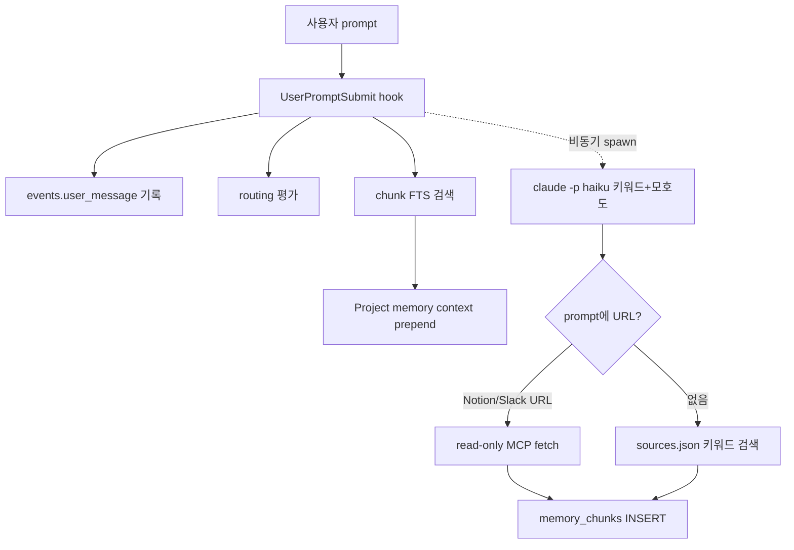

# imprint flow & dependencies

이 문서는 README `## 어떻게 동작하는가`의 보조 문서입니다. 각 hook 단계가 어떤 시스템 도구·외부 서비스에 의존하는지, 그리고 의존이 누락됐을 때 plugin이 어떻게 graceful하게 degrade하는지를 정리합니다.

## 핵심 원칙

**모든 의존은 누락될 수 있다.** plugin.log에 WARN 한 줄을 남기고 사용자 turn은 절대 막지 않습니다. hook은 `set -euo pipefail` + 실패 경로 silent skip, 백그라운드 spawn은 `nohup` + `disown`으로 부모 hook lifecycle과 분리.

## 시스템 의존

| 도구 | 역할 | 부재 시 |
|---|---|---|
| `bash` | hook 스크립트 실행 | hook 자체가 동작 안 함 |
| `python3` | `ingestion.py` 실행 · JSON 파싱 · routing 평가 | 동기·비동기 LLM 경로가 silent skip, 사용자 turn은 진행 |
| `sqlite3` | `events`·`memory_chunks` 저장소 | DB write 전부 silent skip, plugin.log WARN |
| `uuidgen` | event/chunk ID 생성 | macOS 기본 포함 |
| `claude` CLI (OAuth 구독) | `claude -p haiku` 백그라운드 호출 | 비동기 ingestion silent fail, 동기 prefill만 동작 |
| Notion / Slack MCP | 외부 소스 lazy-fetch | `sources.json` 정의가 있어도 fetch 0건, 기존 chunk만 prepend |

## hook 단계별 의존 매핑

### SessionStart (세션 시작 / 압축 후 자동 재실행)

| 단계 | 의존 | 부재 시 |
|---|---|---|
| schema 적용 (`schema.sql`) | sqlite3 | session-start 자체 silent exit |
| FTS5 trigram 마이그레이션 | sqlite3 | 한국어 부분일치 검색 약화 (unicode61로 fallback) |
| `<project>/.imprint/` seed | bash, cp | 사용자가 직접 만들거나 `IMPRINT_NO_SEED=1`로 끔 |
| `soul.md` emit (stdout) | cat | persona prepend만 누락, 다른 경로는 정상 |

### UserPromptSubmit (프롬프트 진입 직전)

| 경로 | 의존 | 부재 시 |
|---|---|---|
| 동기 events 기록 | sqlite3, uuidgen | 기록만 누락, 컨텍스트 emit 진행 |
| 동기 routing 평가 | python3 + `.imprint/UserPromptSubmit.md` | routing 권고 prepend 없음 |
| 동기 chunk 검색 | sqlite3 (FTS5 trigram) | `[Project memory context]` 블록 비어 emit |
| 비동기 분석·페치 | claude CLI + Notion/Slack MCP | 새 chunk 누적 0건, 기존 chunk만 다음 turn 노출 |

### Stop (응답 종료 직후)

| 경로 | 의존 | 부재 시 |
|---|---|---|
| 동기 응답 archive | sqlite3, transcript_path 파일 | `events.llm_response` 기록 누락 |
| 비동기 chunk 추출 | claude CLI + OAuth | 자동 추출 0건, `/memory remember`로 수동 보강 가능 |

## 운영 환경 변수

`scripts/imprint/lib/ingestion.py`·각 hook이 읽는 환경 변수입니다. default를 그대로 두는 게 안전하고, 사용자 환경(타임아웃 부족, MCP 서버 이름 다름 등)에 맞춰 조정할 때만 건드립니다.

| 변수 | 기본값 | 의미 |
|---|---|---|
| `IMPRINT_AMBIGUITY_THRESHOLD` | `0.5` | 이 값 이상이면 `[Refined prompt suggestion]` 블록 prepend |
| `IMPRINT_CLAUDE_TIMEOUT_PREFILL` | `25` | 모호도 분석 `claude -p` 타임아웃(초) |
| `IMPRINT_CLAUDE_TIMEOUT_FETCH` | `45` | 외부 소스 fetch `claude -p` 타임아웃(초) |
| `IMPRINT_CLAUDE_TIMEOUT_EXTRACT` | `30` | Stop chunk 추출 `claude -p` 타임아웃(초) |
| `IMPRINT_CLAUDE_BIN` | `claude` | claude CLI 경로 |
| `IMPRINT_BYPASS_HOOKS` | `0` | `1`이면 hook이 즉시 종료 (재귀 가드, 백그라운드 서브프로세스에 자동 주입) |
| `IMPRINT_DISABLE_EXTRACT` | `0` | `1`이면 Stop hook의 chunk 추출만 비활성 |
| `IMPRINT_ALLOWED_TOOLS_FETCH` | (Notion·Slack 와일드카드) | fetch `claude -p`에 전달할 `--allowed-tools` 값 |
| `IMPRINT_NO_SEED` | `0` | `1`이면 SessionStart의 `.imprint/` 시드 비활성 |
| `IMPRINT_HOME` | `~/.claude/imprint` | DB · log 저장 위치 |
| `IMPRINT_ADVISOR_TIMEOUT` | `60` | `advisor.sh`의 codex/gemini/합성 호출 타임아웃(초). `timeout`/`gtimeout` 미설치 시 wrapping skip |
| `IMPRINT_REDACT_RULES` | (사용자 파일 ↔ plugin default) | `memory remember --redact` 룰셋 경로. 미지정 시 `~/.claude/imprint/redact-rules.json` → plugin default 순 |

## 데이터 위치 요약

| 경로 | 내용 |
|---|---|
| `<project>/.imprint/soul.md` | 세션 시작·압축 후 자동 prepend되는 persona·동작 규칙 |
| `<project>/.imprint/UserPromptSubmit.md` | 키워드 → agent 라우팅 룰 |
| `<project>/.imprint/sources.json` | lazy-fetch 대상 Slack 채널·Notion 페이지 |
| `~/.claude/imprint/app.sqlite` | events · memory_chunks · provider_runs · FTS5 인덱스 |
| `~/.claude/imprint/plugin.log` | hook · dispatcher · ingestion 로그 |
| `~/.claude/imprint/previous-statusline.json` | hud-setup install 시 백업된 이전 statusLine 설정 |

`.imprint/` 폴더는 SessionStart hook이 처음 실행될 때 자동 생성되며 기존 파일은 절대 덮어쓰지 않습니다.
